# Bayesian Network Investigator
*Skills: Python, Probability, Algorithms, Gradient Descent*

### Overview
This prototype application is intended to facilitate construction of Bayesian networks and serve as a simpler version of a Bayesian network in cases where the joint probabilities for each node are mostly unknown and there is not enough data to learn them. It is also able to show paths and nodes in the network that are suspect when contradictory evidence is given.

### Theoretical Background

__Notation__

*p*(*T*) = probability that node of interest is T (true)\
*p*(*e*) = probability of the evidence (nodes set by the user)\
*p*(*T* | *e*) = probability that the node of interest is T given the evidence\
*p*(*e* , *T*) = probability that the node of interest is T and the evidence is correct\
*p*(*Ti*) = probability that the *i*th parent node is T\
*wi* =  weight of parent node\
*Pi* = state (T or F) of *i*th parent node
 
__Simplifications__
1. Binary nodes only (T or F)
2. Only five types of nodes
3. 	The effect of any parent node *i* is related to the weighted probability that the parent is T,
either *p*(*Ti*)*wi* or 1-*p*(*Ti*)*wi*.

__Consequences of the Simplifications__\
Let *p*(*T*) be the probability that the node of interest is true. The definition of the node types is such that the marginal probability is a polynomial of the products of weights and probabilities that parents are T\
*p*(*T*)=*f*(*p*(*T1*)*w1*,...*p*(*Tn*)*wn*)\
and the conditional probability of a node being true (given the state of the parents *Pi*) is a function of the weights\
*p*(*T* | *P1* ...*Pn* )=*f*(*w1*,...,*wn* )
This makes it easier to calculate the probabilities and it means that a network may be constructed without entering the full joint distribution information at each node, which is not always easily derived. 

__Main Node__

Main nodes have a probability of being T if at least 1 parent is T. If all parents F, probability of T is 0.

If the parents are independent, the probability is dependent on the weighted probability of the parents *p*(*Ti*)*wi* as the sum of combinations of the different parents containing from 1 to *n* parents.

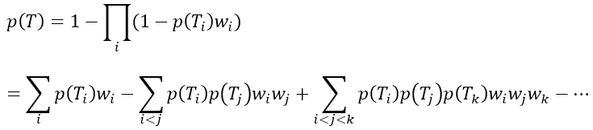

using the inclusion-exclusion principle.

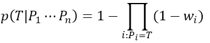
                                         
The conditional probability if all the parents are false is 0, and if at least one of the parents is true the conditional probability is

__Interaction Node__

Interaction nodes have a probability of being T if all parents are T. If any parent is F, the probability of T is 0.
If the parents are independent, the probability is dependent on *p*(*Ti*)*wi* as

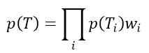

If any parent is false, the conditional probability is 0, if all parents are true, the conditional probability is

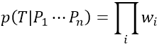

__Exclusion Node__

Exclusion nodes have a probability of being T if 1 parent is T, otherwise the probability is

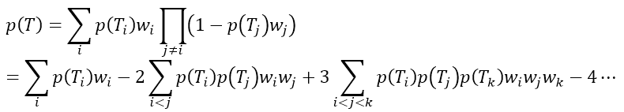

using the inclusion-exclusion principle.

If all parents are false the conditional probability is 0. Otherwise, it is

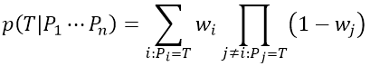

If the all the weights are not 1, then this node is partially exclusive, meaning if more than one is true, the probability will decrease, but not all the way down to 0. If all the weights are 1, then

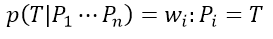

__Inverted Node__

Inverse nodes have probability 1 of being T if at least 1 parent is F, and otherwise

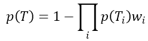

The conditional probability is 1 if at least one parent is F, otherwise

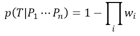

__Inverted Interaction Node__

Inverse interaction nodes have probability 1 of being T if all parents are F, and otherwise

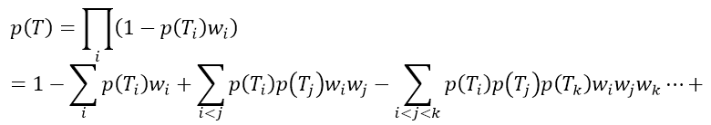

using the inclusion exclusion principle.

The conditional probability is 1 if all parents are F, otherwise it is

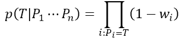

__Common Ancestors__

The above equations apply only if the parents are completely independent. It is possible for some parents to be dependent if they share a common ancestor. 

Note that all the above expressions expand to a linear combination of products of *p*(*Ti*)*wi* and 1. This means all probabilities can be expressed as a linear combinations of probabilities that different combinations of parents are T. 

In the case of shared ancestors, if the above expressions are used, when fully expanded in terms of roots (parentless nodes or Eves, as they are referred to in the code, to distinguish from the root Tk widget) there will be terms with parent probability and weight terms that are raised to some power greater than one, which represents double counting of those terms (treating them as independent when they are actually the same). Therefore the power of all terms in the expanded expressions must be reduced to 1. The resulting calculation is the marginal probability for a single node.

Note that the expressions will contain weights corresponding to itself (the effects of its parents on itself) and the weights of all its ancestors. Therefore the list of weights in any child node’s equation is always longer than that of its ancestors. So the order of inheritance is just the nodes sorted by the number of different weights in the equations.

__Bayesian Inference__

For inference, the network must be able to update based on evidence. This can be done using Bayes’ Theorem.

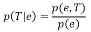

*p*(*e*) is obtained by unsetting all the evidence (calculating the prior network) and then setting the evidence one node at a time in order of inheritance (meaning children always go after parents). Before each node is set, the probability is collected and after all nodes have been set the product of all probabilities is taken. Then any exponents are removed to prevent any common ancestor effects which may occur if evidence nodes are siblings or cousins. *p*(*e* , *T*) is calculated the same way except the node of interest is included in the calculation. This process is repeated for all the non-evidence nodes. Memoization is used to prevent repeat calculations.

__Investigating Contradictory Evidence__

Since the joint distributions contain many simplifications (cases where probabilities are 0 or 1) there can be amplification of problems when contradictory evidence is entered. The calculation of conditional probability of a node being true given evidence may often result in division by 0. Since the intended use of the program is to explore different possible network structures, it is likely that contradictions will occur.

As an alternative, probabilities can propagated forward from the evidence (i.e. calculated from parents) until another evidence node is reached. The evidence in that node can be removed and if the calculated probability of that node differs from the evidence by some threshold, then the path from the two nodes can be flagged as containing a connection that perhaps is not true. In this way, this type of network not only gives information about each node, but also flags potentially erroneous connection paths. Backwards probabilities may be derived by adjusting priors of parentless nodes using gradient descent, before contradictions are evaluated.

In addition, gradient descent on the weights can determine which weights need to be increased or decreased. If the weights are not restricted to between 0 and 1, negative weights can indicate that the type of node should be switched from Main to Inverted or vice versa. Weights greater than 1 indicate that another parent should be added (typically called ‘other’ representing an unknown cause).

__Auxiliary Nodes__

If a node is set as auxiliary, the weights of edges between the node and its parents are set to 1 and the symbols for the weights in the associated equations are replaced by 1. This results in no updating of the weight during gradient descent. Typically modifying nodes can be set as auxiliary to significantly decrease calculation times because the symbol does not need to be tracked throughout the calculation. There is no danger of double counting the weight because 1n=1 for any n. Such nodes are always expected to have a direct link with the parents (weights are all 1). For example an inverted node that represents the negation of a parent will always have a direct link to the parent. Likewise exclusion, interaction, and inverted interaction nodes typically have direct links to parents. If only Bayesian mode will be used, then all nodes with weights of 1 on the edges from their parents can be set as auxiliary to achieve minimum calculation time.

__Graphical User Interface__

The program uses a Tk based GUI. Instructions for creating networks are as follows:

Right-Click = Create node\
Left-Click Hold = Drag node\
Shift-Left-Click = Create edge connecting parent to child node\
Alt-Left-Click = Delete edge (same order as to create edge)\
Click on + to expand node, set evidence, select node type, set node as auxiliary, or delete node\
Control-b= Set prior (enter node name and prior value in Python window)\
Control-s = Save as text file (enter path and filename in Python window)\
Control-o = Load text file (enter path and filename in Python window)\
Control-h = Help (Displayed in Python window)\
Control-p = profile the update() function (for developers, may change to another function as needed)\
Set weights by typing in the entry widget in the middle of the edge (use numerical values between 0 and 1).

The probability of the node being True is displayed below the name of the node. This label is colored as follows:\
Black = Main\
Blue = Interaction\
Green = Exclusion\
Red = Inverted\
Magenta = Inverted Interaction\

If a node is set as evidence (by checking the True or False box) the label is bold.

In investigation mode, if the node is a contradictory descendent of other evidence nodes, the label will have a sunken border. The edge colors represent:

Darker = Edge does not need to be changed much (small change after gradient descent)\
Bright = Edge must be changed (large change after gradient descent)\
Red = Weight must be decreased or edge deleted (decrease after gradient decent)\
Green = Weight must be increased (Increase after gradient descent)\
Blue = Another parent must be added or edge must be deleted (greater than 1 after gradient descent)\
Yellow = Node type needs to be inverted (main to inverted or vice versa) or edge must be deleted (less than 0 after gradient descent, rare)
 
By default, in Investigation mode, the probability of roots is calculated based only on the nodes closest to the roots, and the line colors are based on weight optimization for only the nodes marked as contradictory evidence. Also gradients are calculated for each node with all other evidence nodes fixed (as 0 or 1 it False or True, respectively). 

If ‘Use All Evidence’ is selected, all evidence nodes are used to calculate root probabilities and line colors, and the gradients keep the terms in the equation corresponding to evidence nodes instead of substituting their set values. The loss function is defined as the sum of squares of deviations for all evidence nodes.

The gradient descent for line weights is constrained to between 0 and 1 only if the ‘Constrained’ box is selected. Otherwise it is allowed to go below 0 (resulting in a yellow line) or above 1 (resulting in a blue line).

__Techniques__

Exclusion nodes most often are used as modifiers to enforce mutual exclusivity of different nodes. As a trivial example, if you know your acquaintance has a child named Elizabeth, and that she only has one child, then in the past she was pregnant with a girl.

