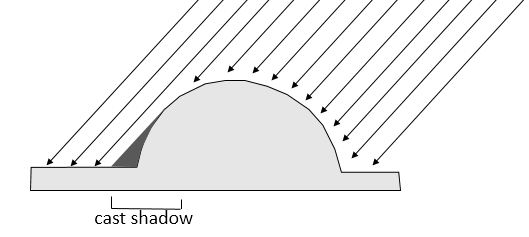

# Depth Map Generator
*Skills: Python, Image Processing, Linear Algebra, Multivariable Calculus*

### Overview
This program generates a depth map from a monocular image of matte monochromatic bas-relief. The algorithm uses physical principles of light to calculate a normal map, which is integrated to a depth map. 

*Prerequisite Libraries: scipy, numpy, imageio, matplotlib, sklearn, skimage, tkinter*

### Motivation
When texturing 3D models, most of the time having only a diffuse channel is not enough. In architectural modeling specifically, it is quite noticeable when the texture of a relief carving consists of only a diffuse channel whose color is from a photograph of the carving. To achieve realistic surfaces without modeling the detail, a bump map (i.e. depth map) or normal map is required. However, it is often the case that there is no available depth map or normal map corresponding to the image. Therefore it is beneficial to have a program that can generate a normal map and depth map from the photograph itself. This program focuses on monochromatic images of bas-reliefs because it is primarily meant for architectural texturing purposes. Generating depth maps from color images is more difficult because it is hard to tell the difference between darker color and shadow, so such images are out of the scope of this project. However, they can be analyzed if the image is first normalized with a user defined color map before inputting into the program.

### Usage
The graphical user interface enables the user to set any of the parameters used in the depth map generation. 

If nothing is changed the default settings will be used. The input image and output normal map and depth map image file names are mandatory. Once everything is filled out, press "OK" and the calculation will begin. When calculation is finished, the following window will appear and the files will have been saved.

The meaning of all the plots above are discussed in the sections below.

## Technical Details
### Diffuse Reflection
The main assumption used to generate the depth map is that when incoming light hits the surface is scattered equally in all directions. This kind of diffuse reflection or scattering is called Lambertian reflectance. This assumption holds true if the surface is the same color throughout and the surface is matte.

If the assumption holds, then the intensity of scattered light reaching the observer is the same for all regions of the surface that have the same amount of incident light. Thus the intensity observed is proportionally to the intensity of incident light.

However, depending on the angle of the light and the shape of the surface, some parts of the surface will have less incident light than other parts. The surface that is normal to the light direction will have the most incident light hitting it per area of the image (the projection of the surface onto the image plane). And the surface that is parallel to the light direction will have the least light. 

The amount of incident light the surface recieves (and thus the amount of scattered light observed) is proportional to the cosine of the negative light vector and the surface normal vector, which is calculated by taking the dot product of the normalized vectors. However, when this cosine is negative the surface is in cast shadow (there cannot be negative light).

A practical example of these principles is how sunlight hits the earth. During the night the observer is in cast shadow. During the day, the amount of sunlight (assuming no clouds) is related to latitude. During the summer there is more incident light because the angle between the light rays and the normal vector of the earth at that particular location (depends on lattitude) is smallest. And in winter it is the largest. The tropic of cancer recieves the most mid-day light during the summer because the normal vector of the earth is the same direction as the light vector.

### Cast Shadow
In most images, regions with cast shadow are not completely black because of other light sources. The first possible source of light is light that is scattered from other parts of the surface. Light reflected from raised parts of the surface will be the most direct where the vector from the origin of the light to the location it strikes in the cast shadow is parallel to the surface normal of the shadow region. Overall, unless the other parts of the surface are much taller than the region of cast shadow, the reflected light will be generally strongest in the horizontal direction.

This can also be seen applying the Huygens-Fresnel principle. The overall wavefront is moving roughly horizontally.

Reflected light from flat areas of the surface are strongest in the areas of shadow where the surface is vertical and the normal is the horizontal, in the same direction as the reflected light source. This also leads to a strong horizontally directed light in the region of cast shadow.

Once again this can also be seen applying Huygens-Fresnel principle.

So overall, reflected light from the surface should be directed approximately horizontally. In addition, reflected light can only come from areas that recieve incident light. Therefore no reflected light can come from the areas of cast shadow, which is in the direction of the incident light. Therefore on average the reflected light is directed roughly in the opposite direction of the incident light, when projected on the image plane.

