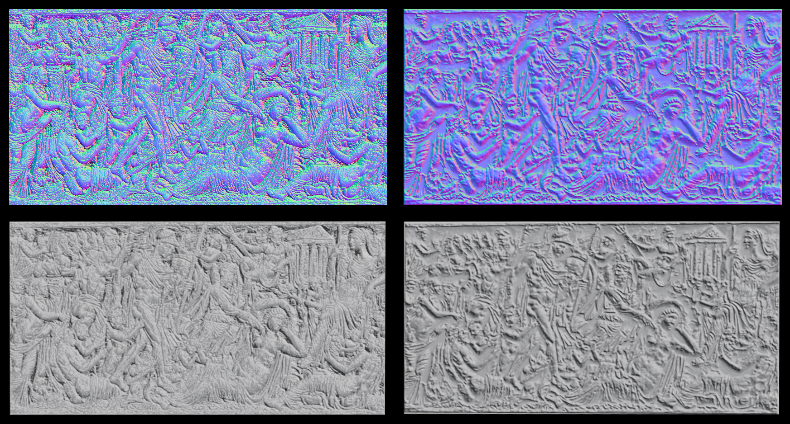

# Depth Map Generator
*Skills: Python, Image Processing, Linear Algebra, Multivariable Calculus, Visualization*

### Overview
This program generates a depth map from a monocular image of matte monochromatic bas-relief. The algorithm uses physical principles of light to calculate a normal map, which is integrated to a depth map. 

*Prerequisite Libraries: scipy, numpy, imageio, matplotlib, sklearn, skimage, tkinter*

### Motivation
When texturing 3D models, most of the time having only a diffuse channel is not enough. In architectural modeling specifically, it is quite noticeable when the texture of a relief carving consists of only a diffuse channel whose color is from a photograph of the carving. To achieve realistic surfaces without modeling the detail, a bump map (i.e. depth map) or normal map is required. However, it is often the case that there is no available depth map or normal map corresponding to the image. Therefore it is beneficial to have a program that can generate a normal map and depth map from the photograph itself. This program focuses on monochromatic images of bas-reliefs because it is primarily meant for architectural texturing purposes. Generating depth maps from color images is more difficult because it is hard to tell the difference between darker color and shadow, so such images are out of the scope of this project. However, they can be analyzed if the image is first normalized with a user defined color map before inputting into the program.

### Usage
The graphical user interface enables the user to set any of the parameters used in the depth map generation. 

If nothing is changed the default settings will be used. The input image and output normal map and depth map image file names are mandatory. The input image should be an image of a monotone (it can be color image, but the relief should not be painted) matte bas-relief, for example

Once everything is filled out, press "OK" and the calculation will begin. When calculation is finished, the following window will appear and the files will have been saved.

The meaning of all the plots above are discussed in the sections below.

## Technical Details
### Diffuse Reflection
The main assumption used to generate the depth map is that when incoming light hits the surface, it is scattered equally in all directions. This kind of diffuse reflection or scattering is called Lambertian reflectance. This assumption holds true if the surface is the same color throughout and the surface is matte.

If the assumption holds, then the intensity of scattered light reaching the observer is the same for all regions of the surface that have the same amount of incident light. Thus the intensity observed is proportional to the intensity of incident light.

However, depending on the angle of the light and the shape of the surface, some parts of the surface will have less incident light than other parts. The surface that is normal to the light direction will have the most incident light hitting it per area of the image (the projection of the surface onto the image plane). And the surface that is parallel to the light direction will have the least light. 

The amount of incident light the surface receives (and thus the amount of scattered light observed) is proportional to the cosine of the negative light vector and the surface normal vector, which is calculated by taking the dot product of the normalized vectors. However, when this cosine is negative the surface is in cast shadow (there cannot be negative light).

A practical example of these principles is how sunlight hits the earth. During the night the observer is in cast shadow. During the day, the amount of sunlight (assuming no clouds) is related to latitude. During the summer there is more incident light because the angle between the light rays and the normal vector of the earth at that particular location (depends on latitude) is smallest. And in winter it is the largest. The tropic of cancer receives the most mid-day light during the summer because the normal vector of the earth is the same direction as the light vector.

### Reflected Light
In most images, regions with cast shadow are not completely black because of other light sources. The first possible source of light is light that is scattered from other parts of the surface. Light reflected from raised parts of the surface will be the most direct where the vector from the origin of the light to the location it strikes in the cast shadow is parallel to the surface normal of the shadow region. Overall, unless the other parts of the surface are much taller than the region of cast shadow, the reflected light will be generally strongest in the horizontal direction.

This can also be seen applying the Huygens-Fresnel principle. The overall wavefront is moving roughly horizontally.

Reflected light from flat areas of the surface are strongest in the areas of shadow where the surface is vertical and the normal is the horizontal, in the same direction as the reflected light source. This also leads to a strong horizontally directed light in the region of cast shadow.

Once again this can also be seen applying the Huygens-Fresnel principle.

So overall, reflected light from the surface should be directed approximately horizontally in the direction opposite to the incident light. 

Reflected light can only come from areas that receive incident light. Therefore no reflected light can come from the areas of cast shadow, which is in the direction of the incident light. Therefore on average the reflected light is directed roughly in the opposite direction of the incident light, when projected on the image plane.

Therefore the reflected light vector is considered to be the negative projection of the incident light vector on the image plane (xy).

### Ambient Light
The second possible source of light in regions of cast shadow is ambient light. This is light coming from the environment. Ambient light can be the same intensity in all directions. In this case surfaces parallel to the image plane receive more light than surfaces perpendicular to the image plane.

This situation can be approximated as a light source pointing in the same direction as the normal of the image plane (in the z direction).

Alternatively, the light source can be from a distant surface that has diffuse reflection. For example if the relief is displayed vertically, the scattered light from the opposite wall would hit the surface. If the relief is displayed horizontally, the scattered light would be from the ceiling. In either case using the Huygens-Fresnel principle this light would be equivalent to light pointing in the z direction, making it the same as the previous case.

### Additional Approximations
As a simplification, only diffuse reflectance will be considered in areas receiving incident light. And either reflected light or ambient light will be considered in the calculations for regions of cast shadow (the user must select which type of light is predominant).

However, all the theory discussed above still does not give enough information to deduce the surface normal vector. It only gives the angle between the normal vector and the light vector. But this still forms a cone with an infinite number of possible normal vectors.

Another major assumption is needed to determine which vector it is. The assumption will be that the contours of the image intensity function (the image itself) and the contours of the actual surface are the same. This means the projection of the normal vector onto the image (xy) plane is parallel to the gradient of the image intensity function (this gradient is estimated using a Sobel filter). Note that the gradient direction is sometimes ambiguous as to whether the normal should be pointing in the same direction or opposite direction (whether the cosine should target 1 or -1). By default the algorithm will target 1. This is called the "convexity" assumption. If the user chooses "concave" as the type of relief, the program will target -1.

There may be instances where the direction of the gradient of the image is not included in the projection of all possible normal vectors onto the xy plane. In this case the vector that is most similar (in terms of cosine) to the gradient vector is chosen (again targeting 1 if "convex", and -1 if "concave").

This normal vector will end up always being one of two extreme normals. Therefore the two extreme normal vectors (the ones that have the largest angle between the normal vector and the negative incident light vector when both vectors are projected on the xy plane) can be calculated and each one tested for similarity with the gradient, rather than testing all possible normal vectors.

*Note the assignment of "convex" here is arbitrary, because depending on the z component of the light vector, the convexity assumption may result in a concave looking surface in the normal map. Adding to the complexity, sometimes during integration of the normal map the convexity will be reversed again. It is best to examine the depth map at the end and invert it if necessary.*

### Determination of Light Direction
The light direction is assumed to be the direction in which there is the most contrast in slices of the image. (Slice is used here to refer to a vector of pixel values that are in a straight line in the image). This is because the midtone areas tend to be oriented orthogonally (or at least not close to parallel) to the light direction on the image plane. This means when moving along the light direction there will be fewer pixels in the midtones and more pixels in the highlights and shadows. This can be seen in the illustration below.

Slicing in the light direction typically yields a distribution that is skewed towards the extremes, while slicing in other directions will result in a distribution that has more intermediate values. This means that the sum of squared deviations from the mean in each slice should be greater in the light direction. This leads to the first component of the light direction desirability score, which is the total sum of squared deviations from the individual slice means (not from the total mean, since that would be the same regardless of slice direction). 

Also notice that adjacent slices are more similar to each other in the direction of the light than in other directions. This leads to the second component of the light direction desirability score, which is the sum of squared deviations from the adjacent slice (calculated for each slice then totaled).

The light direction and the actual geometry of the surface both contribute to the variability of the slices, as can be seen in the following example:

The light direction slice (green) has a larger range (more areas of highlights and shadows) than the red slice (more midtones) in the upper part of the figure. However, in the lower part they are about the same. Here the variance is primarily due to the carved lines in the relief. If the entire image were just these lines, then the slice that is parallel to the lines would have little variance. This has nothing to do with the light direction. So the Sobel magnitude in the direction of the slice is used to correct for the surface geometry effect. The Sobel filter is used for edge detection. So the Sobel magnitude in the direction of a slice indicates how perpendicular edges are to the slice. The more perpendicular the edge is, the more contribution there will be due to the edge direction to the overall variance. Therefore the reciprocal of this magnitude is used as a multiplicative correction factor in the desirability score.

The user can adjust the weights (exponents) of the adjacent sum of squares and Sobel magnitude in the desirability score. The algorithm calculates this score for all angles and chooses the angle with the largest desirability score. The user can also select how many angles the program will scan (more angles means more resolution on the desirability plot and a more precise output angle).

If the user determines that the calculated light direction is not accurate, the user can override the angle.

### Determination of Flat Regions
The angle determined above is the light direction projected onto the xy plane. To obtain the z component additional information is needed. The program calculates this component using the intensity corresponding to flat regions in the image (regions parallel to the image plane, whose surface normal is the z unit vector). In order to determine the intensity for each slice in the direction of the light, the algorithm uses a moving window (of user specified size). For each position of the window, the algorithm calculates the maximum length where the intensity is continuously in the window. 

This maximum length is stored for all window positions for all slices. Then the sum across all slices is taken and plotted against the window position.

The maximum window position is used as the intensity of the flat region in calculations. The above algorithm is based on the assumption that the flat regions in a bas-relief have the largest areas (corresponding to the unraised background of the relief). This assumption may not always hold. Therefore, the user may override this intensity in the settings window.

### Determination of Cast Shadow Regions
To identify regions that are in cast shadow, the program scans through slices in the direction of the light. Drops in intensity greater than a user defined threshold over a user defined window mark the start of a shadow region, if the pixel intensity after the drop is lower than the midtone intensity (the intensity of the flat region, or a user defined intensity). Increases in intensity greater than another user defined threshold over another user defined window mark the end of a shadow region. 

The pixels that are marked as shadow are assigned 1 in a shadow mask, and other pixels are assigned 0. In order to remove noise, any pixel in the mask that is surrounded by at least 6 pixels (out of 8 neighboring pixels) of a different value is assigned that different value.

The histogram is generated for all pixels that are marked as shadow.

To clean up the shadow mask further, the user can define a threshold fraction. This fraction represents the fraction of total area under the shadow histogram. Any pixel falling under the intensity corresponding to the threshold fraction is included in the shadow mask if not already included. For example if the fraction is set to 0.50, all pixels with values within the 50th percentile in the shadow histogram are marked as shadow in the mask.

If the user determines that the shadow mask is inaccurate, the user can override the mask by specifying an intensity below which all pixels will be included in the mask, and above which all pixels will be excluded. Also, if there is no cast shadow in the photograph, the user can set the cast shadow parameter to False.

### Mathematical Treatment
For easier calculation of the cosine, the normal vectors and light vectors will all be considered as unit vectors. Therefore the cosine is simply the dot product. With all the theory and assumptions above, there are enough equations to calculate the normal vector for lit regions and cast shadow regions separately.

The derivations of the formulas used in this program are rather lengthy, so they are not included in this README file. Refer to the [depth map equations PDF document](DepthMapEquations.pdf) for derivations and final formulas.

Prior to calculation, the shadow intensity will be offset according to the offset parameters set by the user. 

The intensity in lit areas will also be offset similarly.

Also, smoothing will be performed on the Sobel map used to perform the calculations before starting calculation. The Sobel magnitude threshold is the value below which the actual gradient is ignored and an iteratively imputed gradient is used instead (imputed from nearest neighbors). Then the resulting Sobel map is smoothed using a Gaussian filter. The smoothing factor is the sigma parameter in the Gaussian filter.

### Normal Map Generation
The normal map is generated by mapping the x, y, and z components of the normal vectors to values for red, green, and blue channels. The y component is reversed, since most programs that use normal maps have y pointing up (instead of down as in a numpy array). The normal vector components are halved and 0.5 is added to each, so that the range is from 0 to 1 for each component.

### Displacement Map Generation
The values of the normal map vectors *n* are used to calculate an x and y displacement map. The x component is calculated as -*nx/nz* and the y component as -*ny/nz*. 

The user can set a threshold value for the maximum absolute displacement. This will help reduce errors due to large spikes in the displacement map. After the displacement maps are generated, they are smoothed. Any pixel with Sobel magnitude (in the Sobel filtered original image) less than the user defined threshold will be Gaussian filtered according to the user specified sigma (smoothing factor). This selectively smooths non-edge pixels.

### Depth Map Generation
If the displacement map were integrable, then any method of integration should yield a perfect depth map. However, due to noise caused by slight surface color differences, and errors caused by all the assumptions that had to be made for calculations, the displacement maps are likely not even close to being integrable. In order to decrease the noise there are 2 algorithms the user can choose from.

The first algorithm integrates from top to bottom and left to right. This integration is repeated *k* times with the image rotated by 90/*k* degrees. After each integration, the result is unrotated. Then all these results are averaged. The number of rotations *k* can be specified by the user. This results in a smoother but flatter depth map with less detail.

The second algorithm is an implementation of the iterative pyramidal integration procedure from the paper V. Nozick. *Pyramidal Normal Map Integration for Real-time Photometric Stereo.* EAM Mechatronics 2010, Nov 2010, Japan. pp.128-132. See the paper for technical details. The algorithm creates a mipmap, which is a series of the same image at lower and lower resolutions (each level of the mipmap pyramid corresponds to halving the x and y dimensions). 

Mipmaps are created for both x and y displacement maps. The depth map is initialized as all 0s. Starting with the lowest resolution map, each pixel is set to the average of the neighboring pixels offset by the displacement values from the displacement maps. This is iterated for each level. Between levels, the depth map is scaled up and the next mipmap level is used for updating. The number of iterations for each level can be specified by the user. The last level can be iterated more times (also specified by user). The result will be a more detailed depth map, but it may be overall less flat (the surface may be undulating or wavy).

At the end, due to various errors accumulated, the depth map may be tilted. Therefore the entire depth map is modeled using a linear model with interaction: z = ax + by + cxy + d, or a quadratic model: z = ax + by + cxy + d + ex2 + fy2. This bias is subtracted from the depth map values. Then the depth map is normalized so that the values are from 0 to 1. 

Finally, the depth map can also be smoothed based on the image Sobel magnitude, the same way the displacement map is smoothed. In addition, there is a final smoothing that is applied to the entire map (without considering the Sobel magnitude).

This depth map can then be used as a texture on a surface.

### Results and Discussion
It is clear that much information is lost in the above example. Much of the deterioration in quality is due to the fact that the image is overexposed, making it more difficult to deduce the normals from slight changes in intensity on the brighter parts of the picture. Some more examples are shown below. (About half the time the shadow threshold was overridden, about half the time ambient light was used instead of reflected light for the cast shadow calculation, and about half the time iterative integration was used instead of rotation). Sometimes the depth map had to be inverted to achieve a the desired result (convex or concave). The original image is shown  on the left, the depth map in the middle, and the depth map applied as a texture (using Maya) on the right.

Overall, the results are not perfect. However, in combination with a faint version of original image as the diffuse layer, some of the details can be restored. In addition, the normal map itself is a bit more accurate than the depth map and can be used instead of the depth map as long as the displacement does not need to be baked. This is shown in this final example.

This is the original image:

This resulted in the following normal map and depth map:

In this case the depth map was inverted before applying it to the texture. 

Then the following images were rendered using these maps.

If the diffuse color is just grey (top left), the normal map gives a fairly detailed rendering of the relief (middle left). The bump map is not as detailed (bottom left). Then on the right the diffuse color is replaced with a faint version of the image. With only the diffuse color (top right) it is fairly obvious that the texture is just an image applied on the surface. With the addition of the normal map (middle right), it looks like a real relief, and the details are enhanced from the image on the left. For the bump map on the bottom right, again some detail is recovered compared to the image on the left, and the final rendering looks still more realistic than using the image alone. 

Overall, this program is able to produce usable depth maps. Although the depth maps have some quality issues, they still enhance the rendering if applied with the faint original image as the diffuse layer. But even more useful perhaps is the normal map itself, which preserves detail while at the same time enhancing the image and making the surface look more realistic.

Finally, the results of this program can be compared against the commercially available software called nDo2. First, the normal map and rendered results are compared. This program's results are on the left and the nDo2 results are on the right.

The depth map results are compared below.

In both the normal map and depth maps, this program produces more subtly accurate results than nDo2. However, the results from nDo2 are smoother, with less high frequency noise, and have more definition of the details - perhaps overexaggerated definition, which leads to the less accurate appearance. Both programs have many parameters that can be tuned, so the results may be improved in both cases. Both programs have their strengths and weaknesses. It is possible that combining the results (either as the normalized sum or product) of both may lead to an optimum balance between presevation of detail and accuracy of form.

