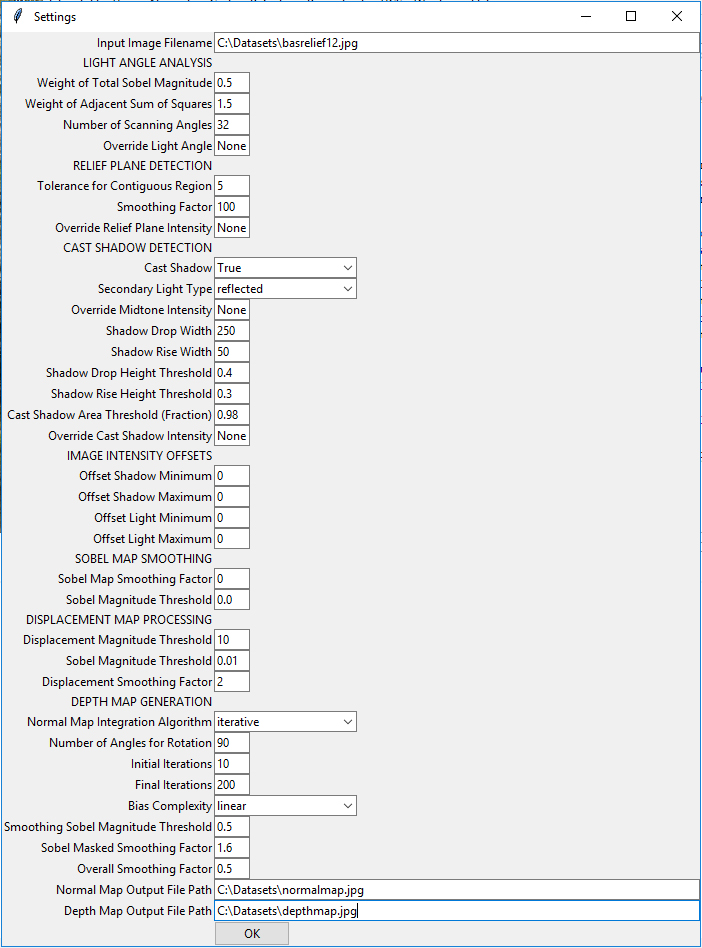

# Depth Map Generator
*Skills: Python, Image Processing, Linear Algebra, Multivariable Calculus*

### Overview
This program generates a depth map from a monocular image of matte monochromatic bas-relief. The algorithm uses physical principles of light to calculate a normal map, which is integrated to a depth map. 

*Prerequisite Libraries: scipy, numpy, imageio, matplotlib, sklearn, skimage, tkinter*

### Motivation
When texturing 3D models, most of the time having only a diffuse channel is not enough. In architectural modeling specifically, it is quite noticeable when the texture of a relief carving consists of only a diffuse channel whose color is from a photograph of the carving. To achieve realistic surfaces without modeling the detail, a bump map (i.e. depth map) or normal map is required. However, it is often the case that there is no available depth map or normal map corresponding to the image. Therefore it is beneficial to have a program that can generate a normal map and depth map from the photograph itself. This program focuses on monochromatic images of bas-reliefs because it is primarily meant for architectural texturing purposes. Generating depth maps from color images is more difficult because it is hard to tell the difference between darker color and shadow, so such images are out of the scope of this project.

### Usage
The graphical user interface enables the user to set any of the parameters used in the depth map generation. 

If nothing is changed the default settings will be used. The input image and output normal map and depth map image file names are mandatory. Once everything is filled out, press "OK" and the calculation will begin. When calculation is finished, the following window will appear and the files will have been saved.

### Light Scattering
