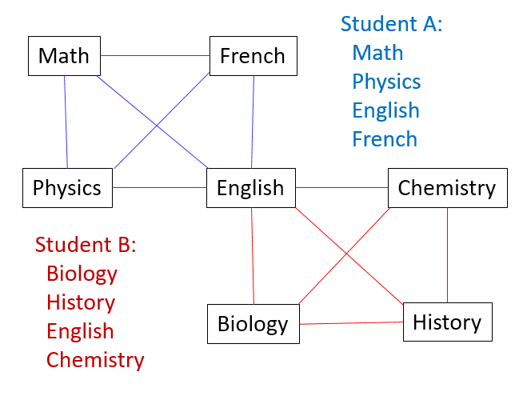

# Final Exam Scheduler
*Skills: Python, Algorithms*

### Overview
This program uses graph coloring theory to generate a final exam schedule from students' enrollment data. Each course is a node of a graph. For each student, the courses that the student is enrolled in are all connected to each other. Once all the student enrollment data is entered, the graph is complete. For example

In the final exam schedule, no course can be in the same time block as any of the courses it is connected to in the graph (in the example above, English must be in a separate block since it is connected to all other courses). Since the graph is not necessarily planar, determining the minimum number of colors (time slots) for the nodes analytically is difficult. However, a workable (but perhaps not completely optimal) schedule can still be calculated using a simple algorithm that iterates through all courses and through all time slots. If a course is not connected to any courses in a time slot, and if the slot is not full, it is added to that slot. Otherwise, the next slot is evaluated. If the course cannot be placed into any existing slot, a new slot is created.

There is also included a feature to generate random student enrollment data with sequentially numbered courses. This is useful for analyzing the average time complexity of the algorithm. 

At worst case the time complexity with respect to the courseload is expected to be O(n2) because a fully connected graph with n nodes has n(n-1)/2 connections. The worst case time complexity with respect to the total number of courses is also O(n2) because the algorithm has to cycle through all courses and all slots (which at worst case is equal to the number of courses if the entire graph is fully connected), and that would be n(n+1)/2 evaluations. The time complexity with respect to number of students is expected to be at worst O(n) because the graph connection process has to take place once for each student.

By comparison, the results of the Monte Carlo simulation are shown below.
