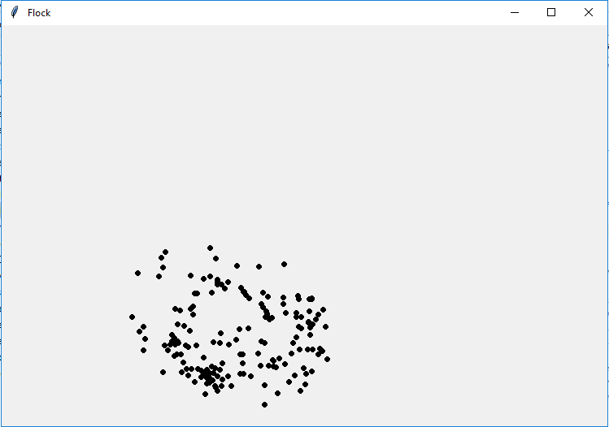
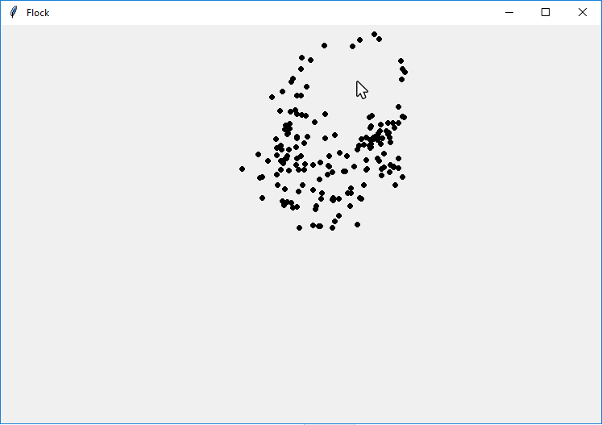

# Flock Simulator
*Skills: Python, Linear Algebra*

### Overview
This program simulates a flock of birds in flight (or perhaps a swarm of bees). The birds are trapped in the window and fly around. The user can act as a predator and chase the birds around the window.

### Usage
Right-Click to start and stop the animation.

Left-Click to chase the flock around the box.

