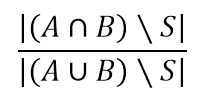

# Literary Pattern Analyzer
*Skills: Python, Natural Language Processing, Visualization*

### Overview
This program consists of tools for use in identifying structural patterns in text:
1. Custom Lexical Dispersion plot (by text segment)
2. Word Intentionality Plot, which plots the probability that the density of a word within a text segment is not random
3. Parallelism Arc Plot, which shows the strength of parallelism between text segments
4. Topic Plot, which uses Latent Dirichlet Allocation to show changes in topic within a text

### Motivation
Today when many read literature, they primarily focus on semantic meaning or the more familiar semantic literary devices such as similes, metaphor, hyperbole, personification etc. However, ancient texts often contain structural devices such as repetition and parallism which are more difficult for today's readers to recognize (possibly because these devices require a stronger long term memory that is associated with the distant past when oral tradition was more dominant). The tools in this program can be used to help detect intentional or rhetorical repetition, identify changes in topic or emphasis, and identify literary devices such as lists of textual units with similar structure, and pairs of parallel or anti-parallel (chiastic) sequences of textual units, which are commonly used in ancient texts.

### Pre-processing
Before analysis, pre-processing is performed, which includes tokenization and splitting the text into segments. A segment can be a verse, a line, or a sentence, and may also be hierarchically defined as chapter:verse, stanza:line, or paragraph:sentence. If the text is saved locally in a .txt file, it can be pre-processed using the function localtext(filepath, split). 

Specify how to split the text into segments using the split argument. If the text already has verse numbers, the split argument should be a regex expression that uniquely identifies the verse numbers, such as '\d+:?:d*' or '\d+ +'. If there are no verse numbers, the split argument can be set to 'sentence', which will split the text by sentence, or the argument can be an integer, which will split the text by number of tokens.  If the text is split by sentence or number of tokens, a Python prompt for the output file path will appear. This file is a copy of the text with the verse numbers inserted.

It may be desirable to split a text in other ways than those mentioned above. Or in some cases where verse numbers and numbers within the text cannot be distinguished using regex, using tags in an html or xml version of the text (rather than .txt) may be preferred. In these cases the user should write a script for scraping and splitting the text and generate the appropriate global variables as follows. The global variable name 'book' must be assigned to the list of tokens in the text (use nltk for to generate the list).

Then a list of pairs (either lists or tuples with 2 elements) of starting word number (index of the token list) and segment identifier must be generated. The global variable name 'verselist' must be assigned to this list. For example: \[(0,'1:1'),(32,'1:2'),(48,'1:3'),(60,'1:4'),(84,'1:5')\].

As examples, the scraping and pre-processing procedure is built into this application for Homer's Iliad and biblical books, primarily due the the relatively straightforward structure of their websites.

### Generalizing Tokens
The token list (referred to as the global variable 'book') is lemmatized and stemmed, generating the token lists 'lemmatizedbook' and 'stemmedbook'. A custom list of stop words and punctuation is defined within in the program. Tokens in the stop word and punctuation lists are ignnored in the next steps. 

Using WordNet, all the words that are synonymous with each other are grouped. (If any word in the text that is a lemma in any synset of another word, the two words are grouped). The name of the group is the word in the group that most frequently occurs in the text. A copy of the lemmatized book is created with each word replaced by the name of it's group. If the word is a stop word or punctuation, it is replaced by "." The resulting book is called 'ideabook'. Another book is similarly created with synonyms and antonyms grouped together. This is referred to as 'ideabook2'.

All these books represent varying levels of generalization for comparing different parts of the text. Using the original book provides the strictest comparison, since words will not match unless they are exactly the same. Using idea book 2 provides the loosest comparison, as any word that is a synonym or antonym will match.

### Measuring Similarity
Jaccard similarity is used to compare two lists of words in terms of content. 

Where A and B are the lists being compared and S are the stop words. Note that only punctuation is treated as stop words, since in the idea books all stop words are replaced by periods. Therefore in the lemmatized book and stemmed book, the non-punctuation stop words are still included in the comparison.

For word order similarity, the program uses the formula proposed by Y. Li, Z. Bandard, D. McLean, J. O'Shea. *A Method for Measuring Sentence Similarity and its Application to Conversational Agents.* Intelligent Systems Group, Department of Computing and Mathematics,
Manchester Metropolitan University.

For one of the texts the words are numbered consecutively. This vector of numbers is *v1*. For the second text's vector *v2*, the entries are determined by looking up the number corresponding the word in the first text. For example if the first text is "John ate shark" and the second text is "shark ate John" then *v1*=\[1,2,3\] and *v2*=\[3,2,1\]. However, this method only works it the two texts share the same words and are the same length, which is hardly ever the case.

The first step in applying this method is to remove any words that are not in both texts. This yields two texts with the same words. The position vector, however, will still use the word position from the original text. For example for the two texts "the dog bit a cat" and "he bought the dog food", *v1*=\[1,2\] and *v2*=\[3,4\].

There may also duplicate words in the list, in which case a new number is assigned rather than assigning the same number. For example the vector for "the dog bit the cat" would be \[1,2,3,4,5\].

However, one text may contain a different numbers of these words than the other. In this case the shorter list is extended to match the longer list. First, each element of the shorter list is assigned the closest element of the longer list. Then empty spaces are filled in with copies of the closest item in the shorter list. For example, for the two texts "the dog bit the cat" and "dog ate the food" alignment is as follows

Text 1: The dog bit the cat\
Text 2: dog dog ate the the

