# Literary Pattern Analyzer
*Skills: Python, Natural Language Processing, Visualization*

### Overview
This program consists of tools for use in identifying structural patterns in text:
1. Custom Lexical Dispersion plot (by text segment)
2. Word Intentionality Plot, which plots the probability that the density of a word within a text segment is not random
3. Parallelism Arc Plot, which shows the strength of parallelism between text segments
4. Topic Plot, which uses Latent Dirichlet Allocation to show changes in topic within a text

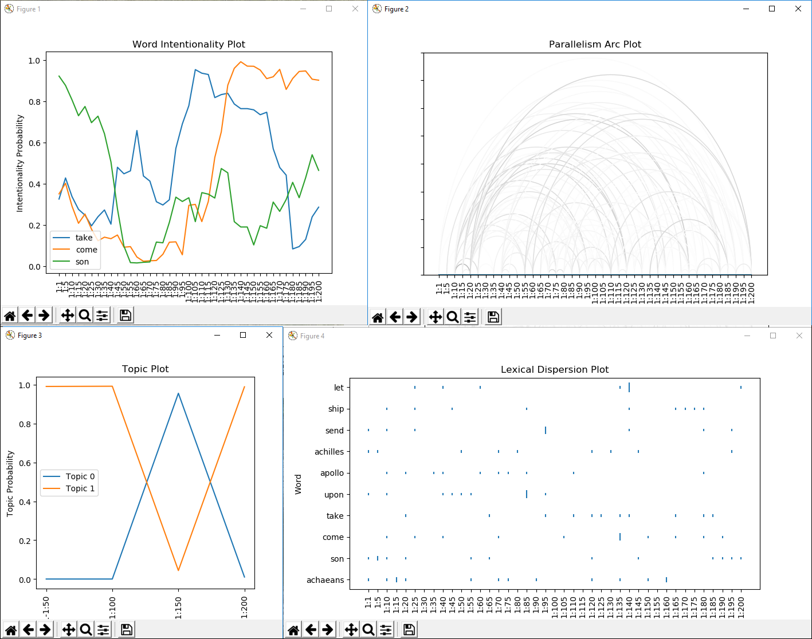

### Motivation
Today when many read literature, they primarily focus on semantic meaning or the more familiar semantic literary devices such as similes, metaphor, hyperbole, personification etc. However, ancient texts often contain structural devices such as repetition and parallism which are more difficult for today's readers to recognize (possibly because these devices require a stronger long term memory that is associated with the distant past when oral tradition was more dominant). The tools in this program can be used to help detect intentional or rhetorical repetition, identify changes in topic or emphasis, and identify literary devices such as lists of textual units with similar structure, and pairs of parallel or anti-parallel (chiastic) sequences of textual units, which are commonly used in ancient texts.

### Pre-processing
Before analysis, pre-processing is performed, which includes tokenization and splitting the text into segments. A segment can be a verse, a line, or a sentence, and may also be hierarchically defined as chapter:verse, stanza:line, or paragraph:sentence. If the text is saved locally in a .txt file, it can be pre-processed using the function localtext(filepath, split). 

Specify how to split the text into segments using the split argument. If the text already has verse numbers, the split argument should be a regex expression that uniquely identifies the verse numbers, such as '\d+:?:d*' or '\d+ +'. If there are no verse numbers, the split argument can be set to 'sentence', which will split the text by sentence, or the argument can be an integer, which will split the text by number of tokens.  If the text is split by sentence or number of tokens, a Python prompt for the output file path will appear. This file is a copy of the text with the verse numbers inserted.

It may be desirable to split a text in other ways than those mentioned above. Or in some cases where verse numbers and numbers within the text cannot be distinguished using regex, using tags in an html or xml version of the text (rather than .txt) may be preferred. In these cases the user should write a script for scraping and splitting the text and generate the appropriate global variables as follows. The global variable name 'book' must be assigned to the list of tokens in the text (use nltk for to generate the list).

Then a list of pairs (either lists or tuples with 2 elements) of starting word number (index of the token list) and segment identifier must be generated. The global variable name 'verselist' must be assigned to this list. For example: \[(0,'1:1'),(32,'1:2'),(48,'1:3'),(60,'1:4'),(84,'1:5')\].

As examples, the scraping and pre-processing procedure is built into this application for Homer's Iliad and biblical books, primarily due the the relatively straightforward structure of their websites.

### Generalizing Tokens
The token list (referred to as the global variable 'book') is lemmatized and stemmed, generating the token lists 'lemmatizedbook' and 'stemmedbook'. A custom list of stop words and punctuation is defined within in the program. Tokens in the stop word and punctuation lists are ignnored in the next steps. 

Using WordNet, all the words that are synonymous with each other are grouped. (If any word in the text that is a lemma in any synset of another word, the two words are grouped). The name of the group is the word in the group that most frequently occurs in the text. A copy of the lemmatized book is created with each word replaced by the name of it's group. If the word is a stop word or punctuation, it is replaced by "." The resulting book is called 'ideabook'. Another book is similarly created with synonyms and antonyms grouped together. This is referred to as 'ideabook2'.

All these books represent varying levels of generalization for comparing different parts of the text. Using the original book provides the strictest comparison, since words will not match unless they are exactly the same. Using idea book 2 provides the loosest comparison, as any word that is a synonym or antonym will match.

### Measuring Similarity
To detect parallelism, it is necessary to compare one verse or line with another. Comparison will be done based on content (shared words) and word order using similarity measures defined below.

Jaccard similarity is used to compare two lists of words in terms of content. 

Where A and B are the lists being compared and S are the stop words. Note that only punctuation is treated as stop words, since in the idea books all stop words are replaced by periods. Therefore in the lemmatized book and stemmed book, the non-punctuation stop words are still included in the comparison.

For word order similarity, the program uses the formula proposed by Y. Li, Z. Bandard, D. McLean, J. O'Shea. *A Method for Measuring Sentence Similarity and its Application to Conversational Agents.* Intelligent Systems Group, Department of Computing and Mathematics,
Manchester Metropolitan University.

For one of the texts the words are numbered consecutively. This vector of numbers is *v1*. For the second text's vector *v2*, the entries are the location of the first text's words in the second text. For example if the first text is "John ate shark" and the second text is "shark ate John" then *v1*=\[1,2,3\] and *v2*=\[3,2,1\]. However, this method only works it the two texts have the same number of each of the shared words. Therefore some modification is necessary to apply this method.

The first step in applying this method is to remove any words that are not in both texts. This yields two texts with the same words. The position vector, however, will still use the word position from the original text. For example for the two texts "the dog bit a cat" and "he bought the dog food", *v1*=\[1,2\] and *v2*=\[3,4\].

There may also duplicate words in the list, in which case a new number is assigned rather than assigning the same number. For example the vector for "the dog bit the cat" would be \[1,2,3,4,5\].

However, one text may contain a different numbers of these words than the other. In this case the shorter vector is extended to match the longer one. To achieve this, the vector *v2* starts out empty. First, in this empty vector the index of each element of the shorter list is placed in the position with the closest matching entry on the longer vector corresponding to the same word. 

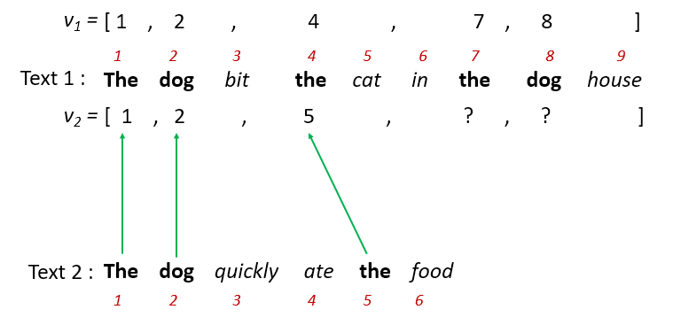

Then the remaining entries are filled in with copies of the closest index corresponding to the same word.

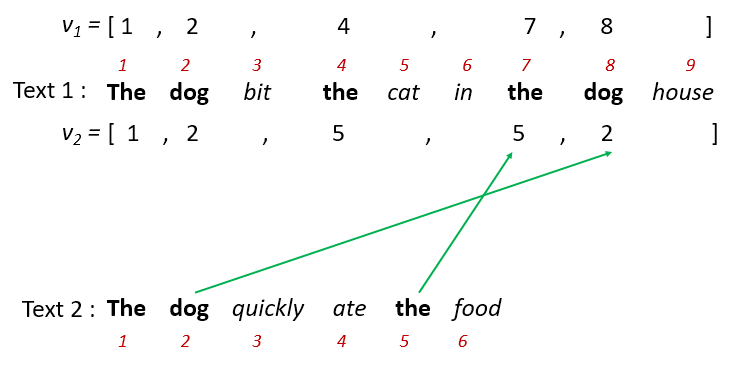

Once the two vectors have been calculated, the order similarity is given by

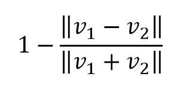

The total similarity is defined as a weighted product of the content and order similarity.

__Total Similarity = Jaccard Similarity x (Content Similarity)&#x03B1;__

Verses can be of arbitrary length, and comparing two verses of different length often results in lower similarity. This is not desirable for parallelism detection. Therefore only a segment of the longer verse, equal in length to the shorter verse, should be taken for comparison. However, it is uncertain which part of the longer verse is most similar to the shorter one. To resolve this ambiguity, similarity is calculated for all possible segments of the longer verse, and the maximum similarity is taken as the final order similarity value.

### Lexical Dispersion Plot
This plot is similar to the nltk Lexical dispersion plot except that the x-axis is in verses, and the length of the bars represents the frequency of the word in the verse. The user can choose which book to analyze, and also how many of the highest frequency words to display. Alternatively the user can specify a list of specific words to be displayed.

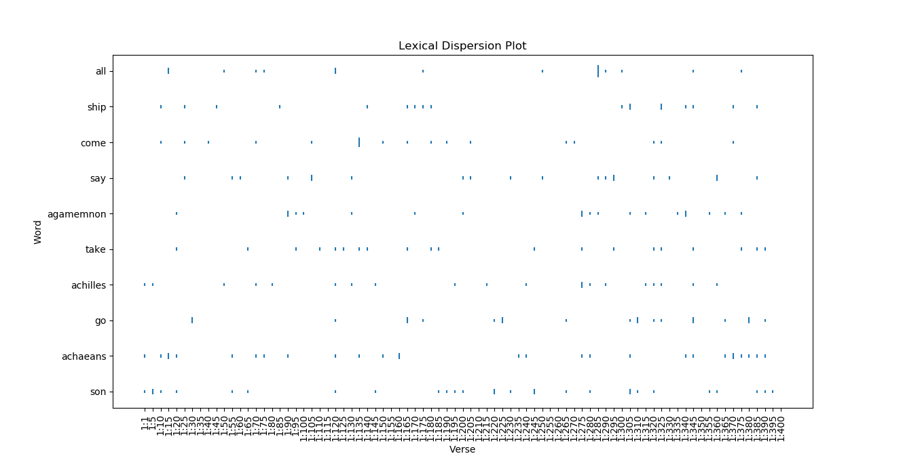

### Word Intentionality Plot
Word intentionality (i.e. word density) is defined here as the probability of observing a certain frequency of a word (or higher frequency) by chance, given the overall frequency in the text. It is a similar concept to td-idf except it is calculated using the binomial distribution. The instance of a word is considered a "success" and any other word is considered "failure." The frequency of the word in the text is the probability of a success. The number of trials is the number of words in a verse. Then binomial distribution is used to calculate the probability given the above parameters.

The user can choose which words to analyze in which book. Alternatively the user can choose a book and any words occurring more than a threshold number of times in that book will be analyzed. The window parameter can be used to analyze the density over a larger window (many verses instead of just one). This can reduce noise.

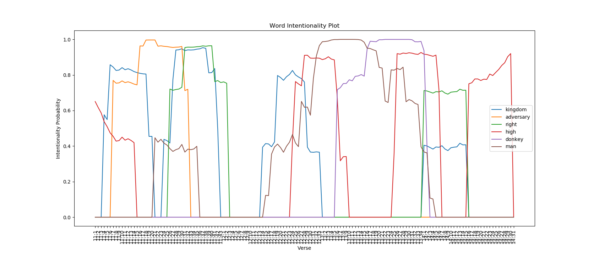

### Arc Plot
The arc plot is used for identifying parallelism. It plots the similarity of every verse with every other verse. The darker arcs represent high similarity. The plot would be too dense if all arcs are shown, so there is a threshold similarity below which arcs will not be displayed. The color is then rescaled to achieve more contrast. The alpha parameter is the weight of word order in overall similarity. The window parameter allows comparisons of multiple verses at a time rather than just one.

Below are the theoretical signature and actual arc plot for a single repetition:\
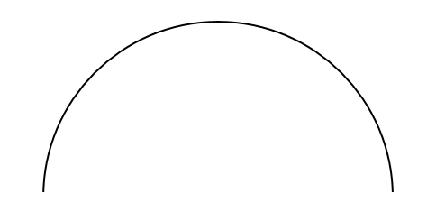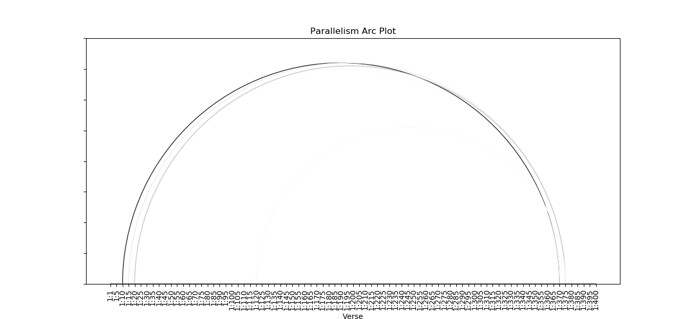

The theoretical signature and actual arc plot for multiple repetition is as follows:\
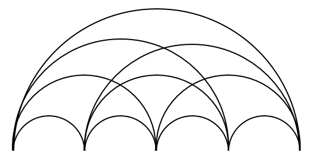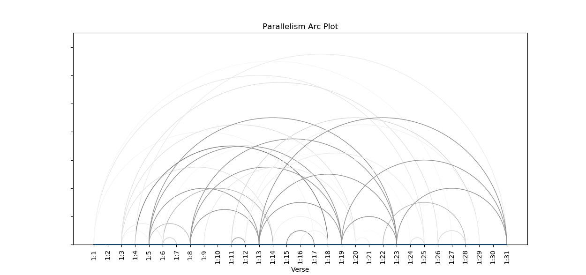

The arc plot can hint at parallelism (e.g. ABCDABCD).\
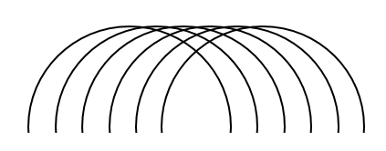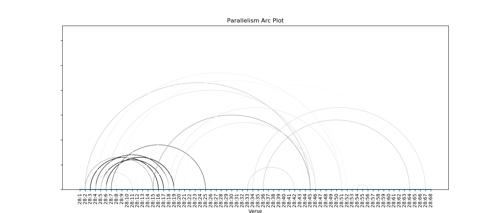

It can also hint at chiastic structure (e.g. ABCDEDCBA).\
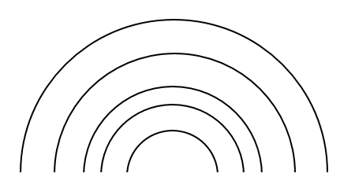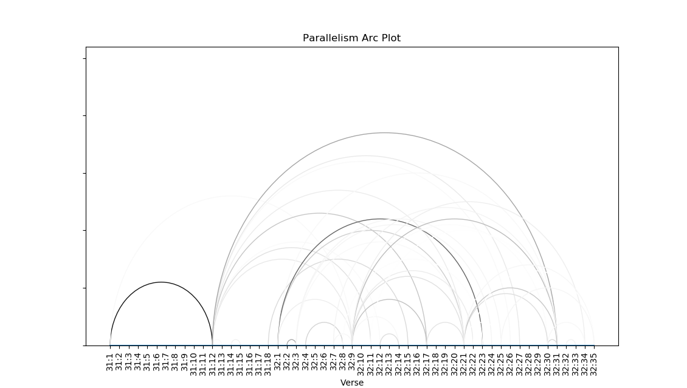

### Topic Plot
Latent topics are calculated using Latent Dirichlet Allocation. This analysis is performed over each segment of a book. The book can be specified, as with the other plots. The window parameter indicates how wide of a segment the analysis is performed over (i.e the size of the moving window). The generalize parameter is used to control the number of topics (higher value results in fewer topics). Based on the nature of the algorithm, the topics are not always reproducible unless the number of passes is increased, but that would increase calculation time.

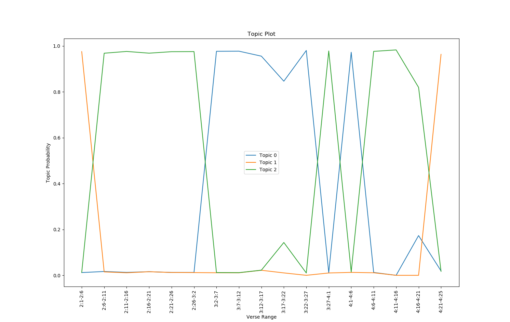

