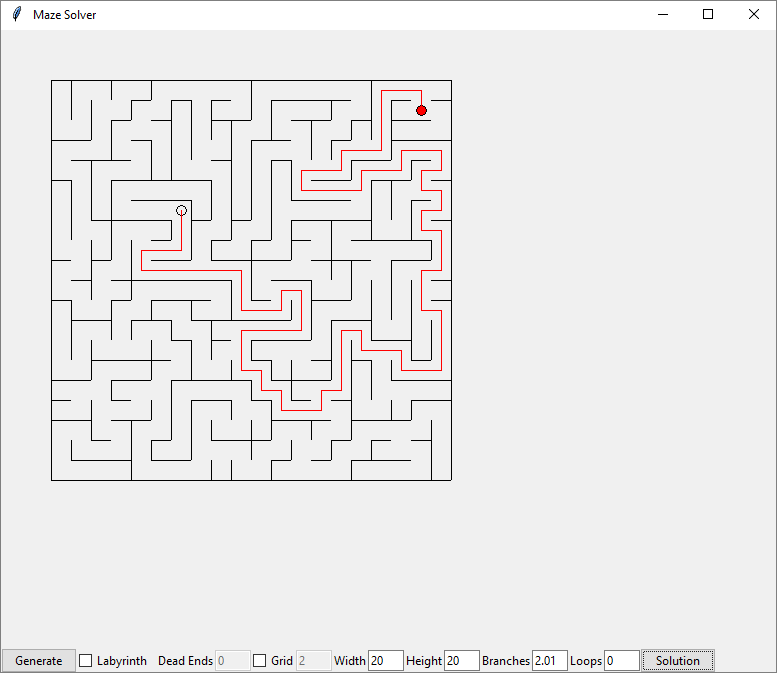

# Maze and Labyrinth Generator
*Skills: Python, Algorithms, Data Structures*

### Overview
This program generates and solves random mazes and labyrinths of variable size. It also allows the user to move a turtle around the maze and has a toggle button to show and hide the solution.

The difference between a maze and a labyrinth is that a labyrinth has only one path and no forks. There are plenty of widely known algorithms for maze generation, but not so much for labyrinth generation. This program uses a unique algorithm for labyrinth generation that involves the use of circular set data structures, which outperforms a depth first search type algorithm. 

The maze generation algorithm uses a disjoint set data structure. 

The program also includes a unique grid type maze, where each grid block is a labyrinth (this algorithm uses depth first search rather than circular lists to generate the mini labyrinths because the depth first search algorithm is capable of generating more variety for small labyrinths, which is important to make the maze look less repetitive). Then the grid blocks are treated like disjoint sets and combined to form the overall maze.

The mazes are solved using Dijkstra's algorithm (each cell is treated as the node of a graph, and the edges are where the wall has been deleted).

### Usage
A screenshot of the user interface is shown below.

The user can specify the width and height of the grid (in terms of the number of cells). The branch parameter determines the maximum number of walls that can be deleted during maze generation. This parameter must be > 2, but does not need to be an integer. The loop parameter creates multiple paths to the target cell.

If Grid is selected, the maze is divided into blocks of specified size, and a labyrinth is generated in each block using
depth first search (keep block size < 7, otherwise the maze generation will be very slow). Then the maze is generated by union of the blocks. 

If labyrinth is selected, an alternative labyrinth generating algorithm is used, based on the union of disjoint cyclical
ordered sets. The dead end parameter controls how likely dead ends will be generated, through subdivision of the
labyrinth path and the performing union on the resulting disjoint paths. 

The user may build or destroy walls in the maze or move the target. Use Alt+Left Click on two cells to destroy the wall between the cells, and Shift+Left Click on two cells to build a wall between the cells. The labyrinth start and end points are set by using Ctrl+Left Click and Ctrl+Right Click. Not all combinations of starting and ending points can yield a labyrinth. In these cases the path will be extended beyond the end or start point. Usually moving either point by 1 space will create a feasible labyrinth.

Depending on the parameters and user actions, there may be multiple solutions to the maze.
The shortest solution path is calculated using Dijkstra's algorithm, and can be shown by clicking the "Solution" button.

### Maze Generation
The maze begins with each cell having all 4 walls. Each cell is a disjoint set. The union of a disjoint set produces a new set. Each set has walls that form its border. When two sets are unioned a wall is randomly selected from the intersection of the border walls of the two sets. If the cells neighboring the walls already have walls deleted, the probability of deleting the border wall is diminished. The decision to delete or not is made by a random number generator. If the number of deleted walls in a cell exceeds the sum of the random number and the branching parameter, the wall is not deleted and a new border wall is selected randomly. Random adjacent sets are unioned until there is only one set remaining.

The following is an example of this process. the blue and red regions are sets that are unioned.

Typically more complex maze solutions are created when the branching parameter is close to 2.

Loops in the maze (alternate solutions) are created by randomly deleting walls after the maze is generated.

### Labyrinth Generation
The labyrinth generator starts by creating a path from the start and end points. This is the path set. The rest of the space is filled with 2x2 loops, which are circular sets. Then all the sets are unioned. The unioning process is different than the one used to generate the maze. Rather than just deleting a shared wall, the walls are rearranged to combined loops into one long loop, or combine a loop and a path into one long path.

The paths (which are not cyclically connected) are treated as a set, but the loops are treated as circular sets (implemented as cycled lists). To union the sets, the program looks for 2 adjacent cells in each set that are adjacent to each other (forming a 2x2 block). The walls in the center of this block are rearranged to join the two sets. 

The mechanism behind the rearrangement is as follows. The above two loops are represented as cycled lists (the number in the figure below represent the order of items in the list). One set is rotated by cyclical permutation of the order of list items. This rotation is performed until the first and last item of the list are in the 2x2 region. Then the other list is split into 2 lists. The first list is reversed if necessary. Then the lists are combined into one list by inserting the first list between the two parts of the second list. Since both sets are circular, the final set is also circular. Walls are then placed where there are no connections (arrows). A wall is not placed between the first and last cells in the list.

If the ends of the second list are already in the 2x2 area, the second list does not need to be split. 

This union procedure works for two cyclical set or a cyclical set and an ordinary set (path), but not two paths. The procedure is similar to combine a cyclical set with a path except walls except that the resulting structure will not be circular.

A perfect labyrinth is not always possible depending on the size of the grid and the starting and ending positions. Sometimes single cells or incomplete cycles will be left over. If they are adjacent to the path set ends they can be combined, otherwise they will be excluded from the labyrinth, creating an inaccessible space. 

Dead ends in the labyrinth can be created by building a wall randomly in the middle of the labyrinth, and then destroying a random wall to union the resulting two sets. This can create a maze that has some labyrinth characteristics, in that it requires walking through many of the cells to reach the end.

### Grid Maze Generation
This type of maze begins by dividing the grid into subgrids. A labyrinth is generated in the subgrid using depth first search. A layrinth is a single path (which can only visit a cell once) that must cover all cells. Therefore all the possible single paths are explored and the algorithm stops when all the cells have been encorporated into the path. This is a much more time consuming algorithm than the one used above, but it may be more appropriate for smaller labyrinths, since the previous algorithm requires the use of 2x2 units. 

The following is an example of a tree of possible paths, starting from the top left corner of the grid.

Then each grid block is unioned until the maze is complete.

