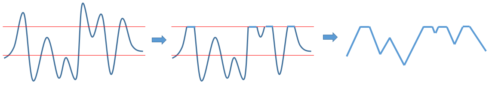
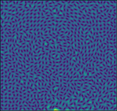

# Mosaic Generator
*Skills: Python, Image Processing, Linear Algebra, Multivariable Calculus, Algorithms Visualization*

### Overview
This program converts an image to a mosaic. The output is an image (diffuse map), depth map, normal map, and specular color map. The algorithm builds upon and extends the work found in the article A. Hauser. *Simulating Decorative Mosaics.* In SIGGRAPH'01: 573-580, 2001.

*Prerequisite Libraries: scipy, numpy, imageio, matplotlib, skimage, tkinter*

### Motivation
For purposes of graphic design or texturing architectural 3D models, sometimes it may be useful to convert an image into a mosaic. Existing filters in programs such as Photoshop fail to produce convincing mosaic effects because they do not take into consideration the contours of the image. The article A. Hauser. *Simulating Decorative Mosaics.* In SIGGRAPH'01: 573-580, 2001 proposes a technique using edge features to generate a directional field, using Lloyd's algorithm with pyramidal distance functions, then rendering tiles. This project extends the first step of the process to automatically detect edge features using a gradient map and various filters. The pixels with the largest gradient are considered edge features, however the algorithm allows for lower features to be included as well. The height of these features is scaled based on the gradient magnitude, thus minor features are allowed to impact the directional field if they are far away from major features. The algorithm for generating the Vornoi diagram is mostly unchanged except a different distance function is used to generate the pyramids, since Manhattan distance results in corners being oriented towards the orientation axes instead of the sides. Finally, another algorithm is added after tile placement to reduce empty space between tiles as well as tile overlap. This is done by iterative gradient descent on the corners of the tiles, where the gradient is re-calculated from the new tile positions and shapes. The tile shapes are used to generate an image of the final mosaic, using the mean of colors covered by each tile as the tile color. For the purposes of 3D texturing, a depth map and normal map are generated by randomly tilting and moving tiles along the z axis. This enables the tiles to sparkle when rendered.

### Usage
The graphical user interface enables the user to set any of the parameters used in the mosaic generation.

If nothing is changed the default settings will be used. The input image file path and name and output file path are mandatory. The input image should ideally be a color image, like this medieval Byzantine fresco below:

Once everything is filled out, press "OK" and the calculation will begin. When calculation is finished, the following window will appear and the files will have been saved.

The meaning of all the plots above are discussed in the sections below.

The file names are MosaicDiffuse.png, MosaicSpecular.png, MosaicDepth.png, and MosaicNormal.png. If the script is run again, it will save over the original files. If the original files are to be kept, rename them, move them to a different folder, or save the new files in a different folder.

## Technical Details
### Gradient Calculation

The first step in generating the mosaic is calculating the gradient of the image. A Sobel filter is a simple method that is employed for this purpose. However, this filter only takes into consideration the neighboring pixels, which may not be appropriate in cases where the image is high resolution, or where features are thick outlines rather than edges. In addition, the Sobel filter can only be applied to the channel sum or magnitude of color images, making it less sensitive to changes in hue. Therefore in addition to the Sobel filter, a custom method of calculating the gradient is used. This custom method allows the specification of the number of pixels on each side that will be used to calculate the gradient. In addition, rather than using the usual convolution procedure, a modified procedure is employed to catch outlines as well as edges.

The first step in gradient calculation is to calulate the weight matrices for the x and y components. The dimension of each matrix is 2r+1, where r is the number of pixels on each side of the center pixel, as specified by the user. The weight is equivalent to the normalized x or y component (respectively) of the vector from the center of the matrix to each other point in the matrix.

Next, the distance function for any 2 pixels (reprsented as vetors in RBG space) is calculated as follows.

The magnitude of the difference is equal to the sum of squared differences in RGB values, and the sign is equal to the sign of the sum of differences in RGB values.

Next, the matrices are calculated with weighted difference between each pixel and the center pixel.

Finally, the magnitude of the gradient is calculated as follows.

The differences on each side of the central pixel are summed separately, then the absolute values of both sums are added together. This enables the detection of outlines by preventing the differences on each side from cancelling out. Finally, the root mean square is calculated for the resulting x and y differences.

The resulting gradient map is shown below on the left, and compared with the Sobel magnitude of the sum of RGB channels on the right.

Note how the thick black lines in the original image show up in the custom gradient magnitude map. The Sobel filter has slightly more fine detail. Therefore, a user defined linear combination of the two maps is used in the next steps.

Since both maps contain noise, a reduction in noise is achieved by using a uniform filter with a user specified number of pixels. This penalizes high gradient points in the map that are isolated. 

Next, all points with gradient less than a user specified threshold are set to zero to reduce noise further.

Finally, using the filtered gradient, cones are calculated in separate layers for all points above a user defined threshold, and at each pixel the height of the layer with the largest magnitude is chosen. The height of the cones is set based on the magnitude of the gradient. An upper limit to cone height is set by the user to make all featues above a certain magnitude equal. These features that are at the maximum height are the major features. Minor features may often be covered up by the larger ones, except when major features are far away.

Due to the noisy nature of the gradient maps, sometimes features may appear as dotted lines. Therefore a Gaussian filter with a user specified radius is used to smooth the features.

The gradient of the result is taken using a Sobel filter. This results in a directional field that will orient the tiles.

### Vornoi Diagram Generation

Vornoi diagram generation begins with placing a user specified number of centroids evenly spaced throghout the image. Pyramids are calculated for each centroid, using the directional field to orient the pyramids, similar to Hauser's method. However, rather than using Manhattan distance, which has the corners aligned with the orientation axis, the equation used to generate the pyramids is as follows, where u is the orientation vector and v is the perpendicular vector.

As in Hauser's method, the aspect ratio factor is included to stretch tiles near edges. This results in the following pyramids and Vornoi diagram.

A binary edge mask is created from the gradient map of the original image by setting points above a user specified threshold to 1 and all other points to 0. This is used later on to move Vornoi regions away from edges, ensuring the the tiles end up along the edges instead of overlapping them.

Using this edge mask, pixels that lie on edges can be disregarded to weighted smaller than other pixels (with a user specified weight) when each regions pixel coordinates are averaged to determine the centroid. As with Hauser's method, this ensures tiles move away from edges.

After calculating the centroids, the pyramids are recalculated and the process is iterated. After a user specified number of iterations, the final Vornoi diagram is obtained.

The resulting diagram (left) is compared to the mosaic filter (middle) and the crystallize filter (right) from Adobe Photoshop, all generated with a similar tile size. The mosaif filter uses evenly spaced square grid tiles, similar to the initial condition described above, except without orientation information. The crstallize filter is similar to a Vornoi diagram generated using circular cones instead of oriented pyramids.

