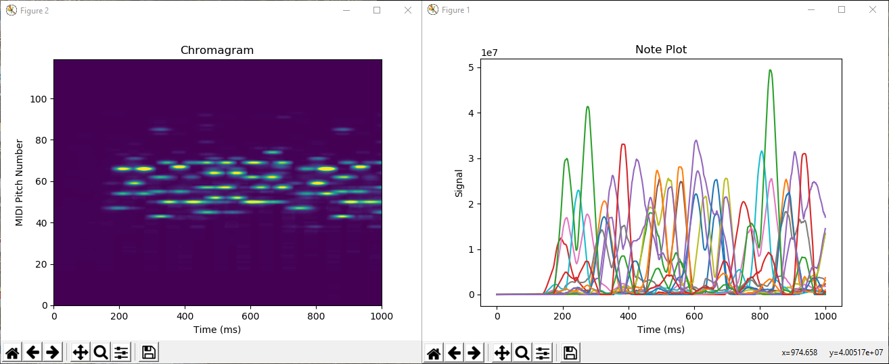
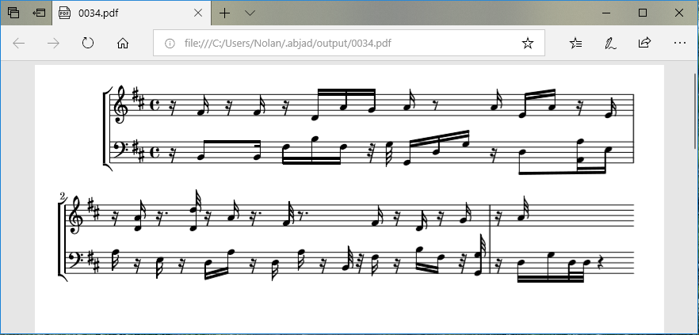
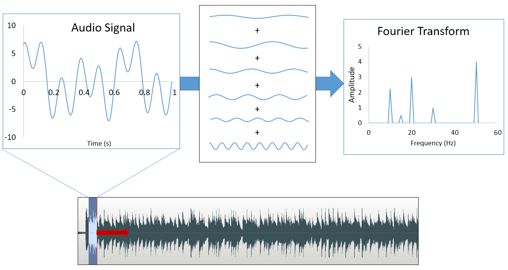
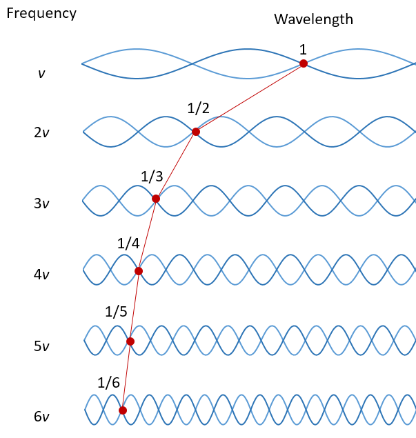
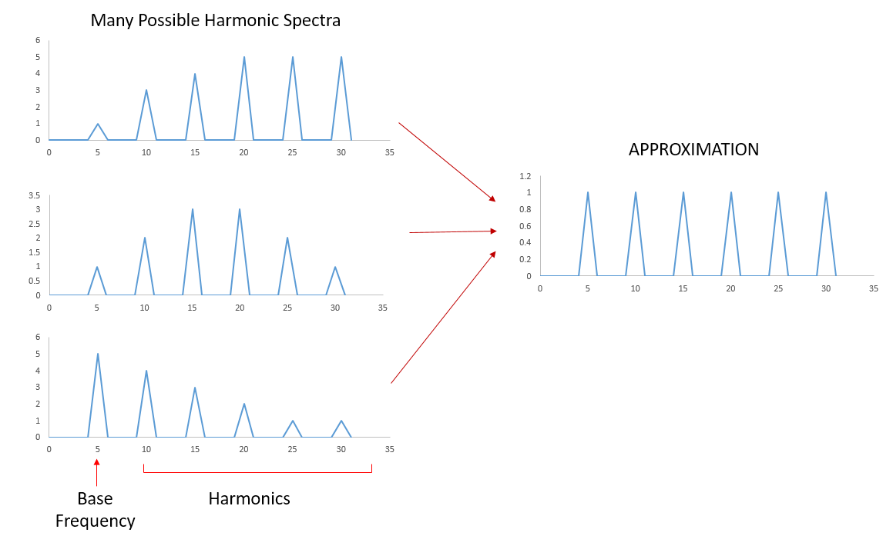
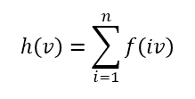
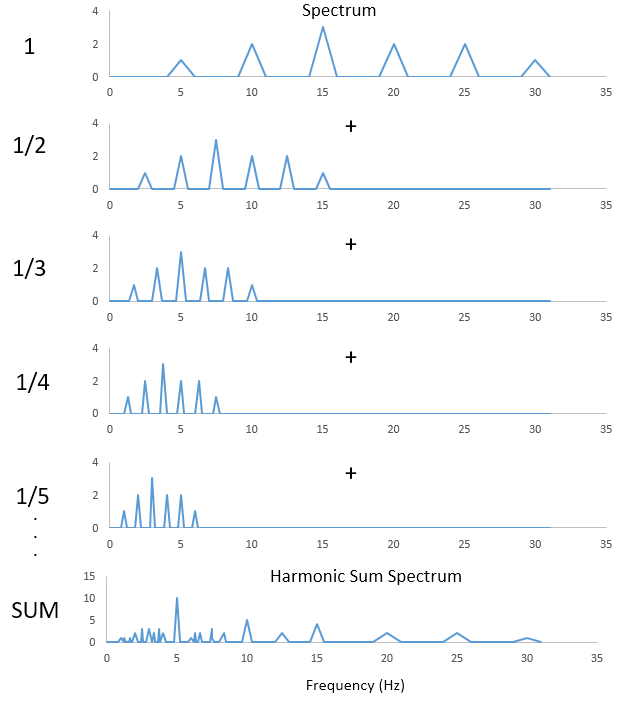

# Music Transcriber
*Skills: Python, Audio Processing*

### Overview
This program is a rudimentary music transcriber. It uses fast Fourier transform to extract the frequency spectrum from a moving time window. The Harmonic Sum Spectrum is used to identify pitches and generate a chromagram. A second derivative peak detection algorithm is used to detect note onset and duration. Note starts and end times are aligned based on overlapping and adjacent notes. Note duration is then assigned to the closest matching assignable note duration. The inaccuracies in the results illustrate challenges in music transcription such as octave errors, interference from harmonics, note decay overlap, and beat detection.

### Usage
The graphical user interface is shown below.

To transcribe an audio file, enter the file path in the settings window. Parameters can be adjusted if necessary. The parameters are explained in following sections. Choose and output format (Treble, Bass, or Treble+Bass). Then press OK to start transcription. A chromagram and note plot will be shown. 

Save these plots if so desired. Then after closing the two windows, the score will display.

## Technical Details
### Pitch Detection
Pitch is directly related to the main frequency of a sound wave. Music audio data is a mixture of sound waves at different frequencies. It can be considered a linear combination of sine and cosine waves of different frequencies, where the sine and cosine components form a basis in terms of which any time shift in the wave can be expressed. To convert the waveform (intensity vs. time) into a spectrum (amplitude vs. frequency), the coefficients of all the different sine and cosine components must be determined. This is done with fast Fourier Transform. Since pitch changes over time, the audio data is split into small time segments. Fourier Transform is performed on each segment.

It would seem that once the spectra are obtained, the pitches can be determined. Unfortunately, music is not that simple. When most instruments play a note, there is a base frequency that corresponds to pitch. However, there are also harmonics, which correspond to frequencies that are integer multiples of the base frequency (*v*).

Each instrument has a different proportion of each of the harmonics. In many cases the base frequency has a lower amplitude than the harmonics. Complicating things even further, some instruments have different harmonic signatures depending on how loudly they are played. In order to determine the actual frequency accurately, deconvolution would have to be done using the harmonic signatures of all relevant instruments and volumes as basis functions. This data, however, was not available for this project, so a major simplification was needed. The harmonic signature was assumed to be uniform for up to a certain number *n* of harmonics (this is the maximum number of harmonics, which can be set by the user).

With this simplification, deconvolution can be done using the Harmonic Sum Spectrum. This spectrum is defined as

Visually it is the sum of spectra that are scaled by integer factors.

