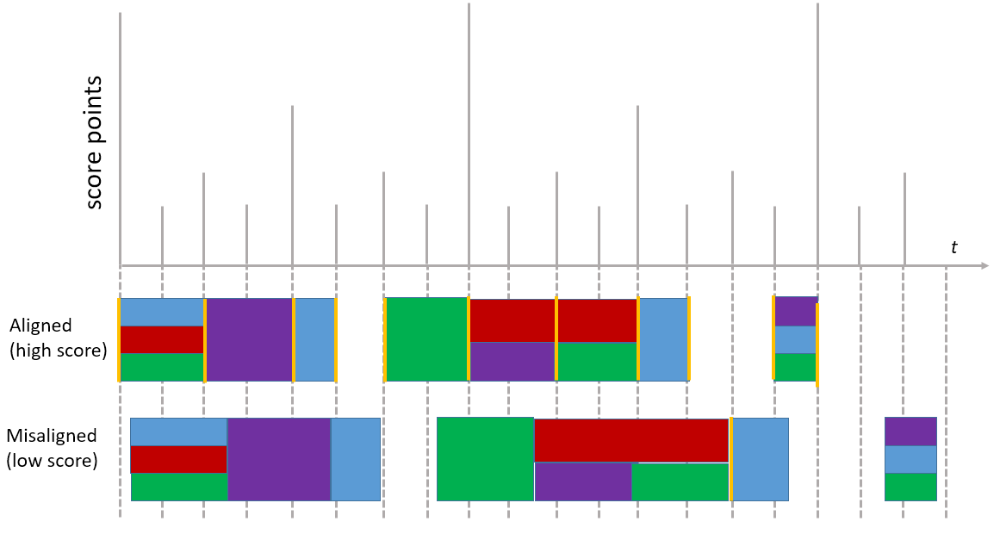
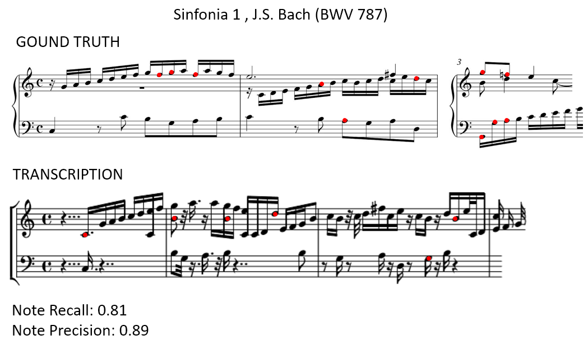
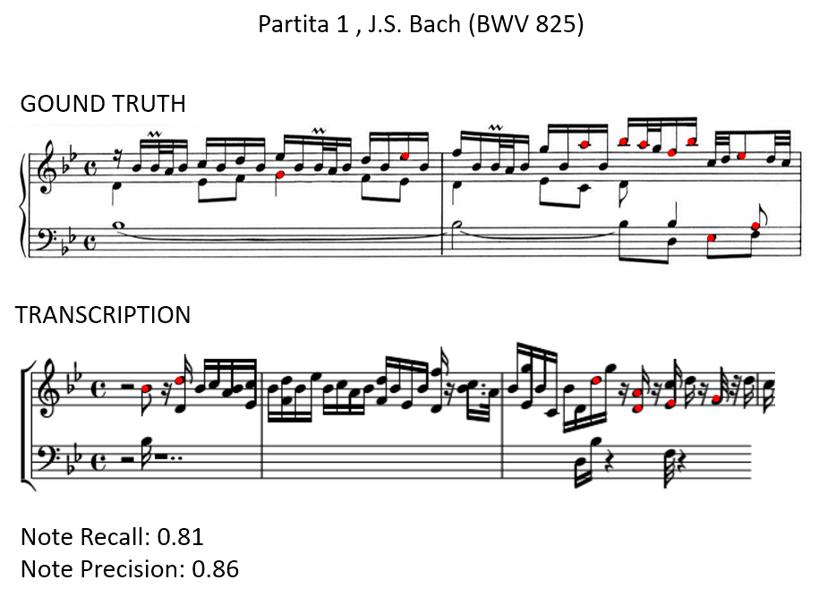
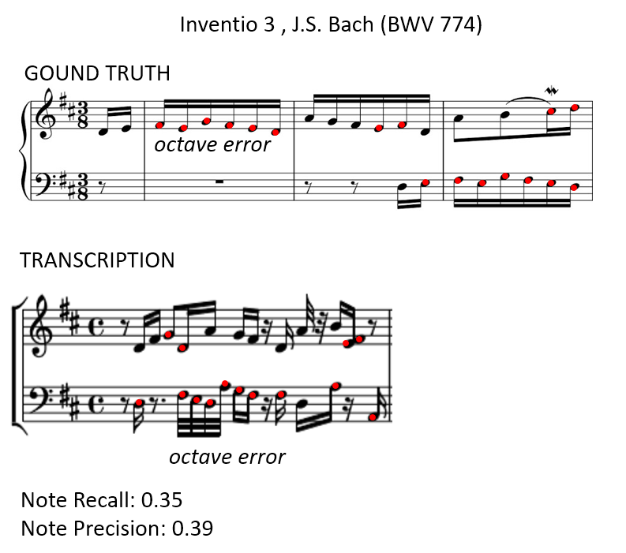

# Music Transcriber
*Skills: Python, Audio Processing*

### Overview
This program is a rudimentary music transcriber. It uses fast Fourier transform to extract the frequency spectrum from a moving time window. The Harmonic Sum Spectrum is used to identify pitches and generate a chromagram. A second derivative peak detection algorithm is used to detect note onset and duration. Note starts and end times are aligned based on overlapping and adjacent notes. Note duration is then assigned to the closest matching assignable note duration. The inaccuracies in the results illustrate challenges in music transcription such as octave errors, interference from harmonics, note decay overlap, and beat detection.

*Prerequisite Libraries: numpy, scipy, matplotlib, sklearn, abjad (and lilypond), tkinter*

### Usage
The graphical user interface is shown below.

To transcribe an audio file, enter the file path in the settings window. Parameters can be adjusted if necessary. The parameters are explained in following sections. Choose and output format (Treble, Bass, or Treble+Bass). Then press OK to start transcription. A chromagram and note plot will be shown. 

Save these plots if so desired. Then after closing the two windows, the score will display.

## Technical Details

### Pitch Detection
Pitch is directly related to the main frequency of a sound wave. Music audio data is a mixture of sound waves at different frequencies. It can be considered a linear combination of sine and cosine waves of different frequencies, where the sine and cosine components form a basis in terms of which any time shift in the wave can be expressed. To convert the waveform (intensity vs. time) into a spectrum (amplitude vs. frequency), the coefficients of all the different sine and cosine components must be determined. This is done with fast Fourier Transform. The user can specify the range of frequencies for which the coefficients are calculated. Since pitch changes over time, Fourier Transform is performed on a small window, which is moved along the data. The user can specify the window and step size. The transcription region parameters specify where to start transcription and how many steps to take.

It would seem that once the spectra are obtained, the pitches can be determined. Unfortunately, music is not that simple. When most instruments play a note, there is a base frequency that corresponds to pitch. However, there are also harmonics, which correspond to frequencies that are integer multiples of the base frequency (*v*).

Each instrument has a different proportion of each of the harmonics for each pitch. In many cases the base frequency has a lower amplitude than the harmonics. Complicating things even further, some instruments have different harmonic signatures depending on how loudly they are played. In order to determine the actual frequency accurately, deconvolution would have to be done using the harmonic signatures of all relevant instruments and volumes as basis functions. This data, however, was not available for this project, so a major simplification was needed. The harmonic signature was assumed to be uniform for up to a certain number *n* of harmonics (this is the maximum number of harmonics, which can be set by the user).

With this simplification, deconvolution can be done using the Harmonic Sum Spectrum. This spectrum is defined as follows, where *f(v)* is the Fourier Transform spectrum.

Visually it is the sum of spectra that are scaled by one over an integer.

From the example above it is clear that the Harmonic Sum Spectrum has a maximum at the base frequency. For any frequency, the only interference in the Harmonic Sum Spectrum comes from undertones. These are lower notes that have the base frequency as a harmonic. Deconvolution must be performed to subtract the contribution from these lower frequencies. Combining the definition of the assumed harmonic signature with the definition of the Harmonic Sum Spectrum, we obtain the following

Then making a slight approximation the final contribution from the *j*th undertone is obtained.

After correction for the contributions from all undertones, the new Harmonic Sum Spectrum is

To avoid noise amplification, undertones lower than 3 Hz are not included in the calculation.

The above approximations allow the program to determine pitch without the used of massive libraries of instrument harmonic signatures. However, because of the approximations, there will inevitably be errors in pitch detection. The most common error is the octave error, where the pitch is detected as being the first harmonic or first undertone rather than the base pitch.

To reduce some of the noise from these calculations, some filtering is done on the spectrum. The user can specify the fraction of the maximum Fourier Transform coefficient below which all coefficients will be set to zero before calculating the Harmonic Sum Spectrum. After the Harmonic Sum Spectrum is calculated, the result is filtered again, removing any signals below the minumum absolute HSS threshold (set by user). Finally, there is also a threshold below which undertone correction is not performed. 

Finally, the corrected base frequencies are converted to pitch using the following formula.

The fuction above is used to bin amplitudes by their pitch. Multiple signals placed in the same pitch bin are summed. The epsilon term is a user defined pitch correction term, expressed in terms of half-tones. This is used to correct for an out of tune instrument or alternate tunings.

The result of this process is called a chromagram. This is what is displayed in the plot windows before the score is output.

### Key Detection
Key detection is performed using a linear model. The sum of responses from all tones is calculated. This sum is modeled as a linear combination of a vector a ones (representing all possible notes), a scale vector (corresponding to only notes in the scale of the key), and a triad vector (corresponding to tonic, third, and dominant). These three vectors are chosen because most songs follow a pattern where notes adhere to the scale and the triad notes are more predominant than other notes. These vectors are defined for all major and minor keys. The model is created for all these keys, and the one with the highest R2 is chosen as the key.

### Note Detection
From the chromagram, the transcription step size can be set (as number of chromagram points). This defines wider segments used for note detection and rhythm analysis. The chromagram (binned Harmonic Sum Spectrum) results within each segment are summed in order to reduce noise.

This creates a lower resolution smoothed chromagram, which helps in the note detection steps.

For note detection, the first and second derivatives of the chromagram are calculated for each channel (tone). Derivative calculations often produce random error, so the user can specify a first and second derivative window for smoothing by moving average prior to derivative calculation. 

Note detection relies on identifying maxima in both the signal and the negative second derivative. Maxima are identified as points for which all points within a window around the point being analyzed must be lower than the point being analyzed.

This extrema detection window can be set for both the signal and second derivative. 

The algorithm also matches the position of maxima in the signal and negative second derivative. The tolerance for this match can also be set by the user.

Finally the threshold for note detection can be set. There is an absolute threshold as well as a relative threshold. The absolute threshold prevents detecting noise as notes. The relative threshold (expressed in fraction of maximum intensity across all channels) ensures only the loudest notes are detected.

Once the signal goes above the threshold, note start and end time detection is activated. The note start is defined as the first maximum in the negative second derivative after the threshold is crossed. The note end is defined differently depending on situation. Take this first example (the green circle is a note start, and the red circle is a note end):

If there is no second derivative maximum after the first one, the note end is the point at which the signal falls below the threshold. Moving onto the next example:

Note that the note start corresponds to the negative second derivative maximum regardless of whether there is a maximum in the signal. When there is another second derivative maximum, it marks the end of the note only if it does not correspond to a signal maximum. 

In the next example there is an additional maximum.

In this cases, if there is another negative second derivative maximum that corresponds to a signal maximum, the first note is ended and a second note is started.

If the last negative second derivative maximum corresponds to a signal maximum, the note is ended, a new note is started, and that new note is ended when the signal falls below the threshold.

### Rhythm Alignment
The algorithm above will result in misalignment of many notes because it is unlikely that the maxima will fall in the exact same position for all relevant channels. Therefore note alignment must be performed. The first step is to exclude short notes (the threshold note duration for exclusion can be set by the user).

Then note starts are aligned. The user can set the window within which note starts are all set to the average start time.

Then note ends are aligned with the closest start of any note in any channel, if the time between the note end and other note's start within a user defined window.

Finally the ends of notes from different channels are aligned with the latest note end before a note start.

### Tempo Detection
Next, the tempo is determined. Since the tempo may vary within a piece, the user can set the number of subdivisions the audio file will be split into for tempo determination. The program will scan through different tempos using all channels. For each tempo, the duration of all valid notes are calculated (1/32, 1/16, 3/32, 1/8, 3/16, 1/4, 3/8, 1/2, 3/4, 1, 1.5). The durations of all notes after alignment is compared with the closest valid note duration. The comparison may be biased against dotted notes using the even note duration bias setting. A loss function is calculated as the sum of squared differences between the valid note duration and the actual note duration. Additional loss penalties are added for very short notes (e.g 1/32), and dotted notes (e.g. 3/32, 3/16). The tempo that minimizes the loss is chosen.

Once this tempo is chosen, the channels are split into treble and bass channels, and the scanning is done again on both sets of channels together. Rather than scanning the entire tempo range, only a range centered on the previously determined tempo is evaluated. The window for this evaluation range can be set by the user. 

### Beat Alignment
After tempo determination, the closest matching valid note is assigned to each note based on its duration. The lengths of the notes are then adjusted to align with the beats. This is done using an alignment score. For every note whose start aligns with a beat, points are added to the score. More points are added for notes that align with the down beat, or that correspond to half or quarter measures. Fewer points are added for notes that align with shorter duration subdivisions.

The use can set the maximum allowable adjustment for note durations, and the minumum score improvement required to make an adjustment.

### Results and Discussion
The algorithm was tested on 3 small sections of pieces by J. S. Bach. The first two were at a moderate tempo, but the last one is faster. The results are shown below.

 
 
 
 
 

It is clear that the rhythm is quite inaccurate in all 3 cases. The recall and precision of notes is fairly good for the first two excerpts, but the third one is very poor. This is probably because the tempo was faster, but also because quite a few notes were on the wrong octave. This is the octave error mentioned above.

All 3 audio files were piano recordings, so the note start times were clear. One can imagine that for other instruments, especially stringed instruments, the results will be even worse. Because of all the assumptions made during the transcription process, it is clear that the transcription results are not very accurate. An expert can easily transcribe more accurately than this program. Although this project did not produce an accurate or usable algorithm for transcription, it demonstrates the complexity of music transcription process and some of the challenges it poses. 
