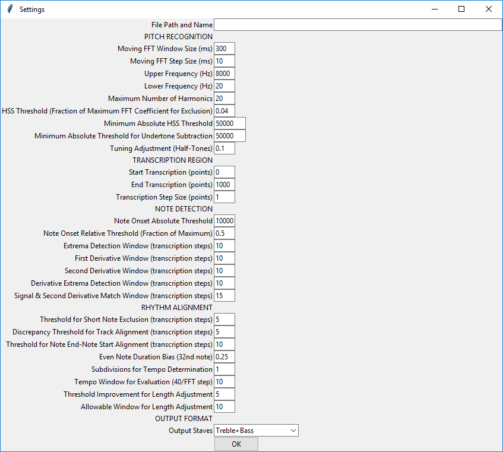

# Music Transcriber
*Skills: Python, Audio Processing*

### Overview
This program is a rudimentary music transcriber. It uses fast Fourier transform to extract the frequency spectrum from a moving time window. The Harmonic Sum Spectrum is used to identify pitches and generate a chromagram. A second derivative peak detection algorithm is used to detect note onset and duration. Note starts and end times are aligned based on overlapping and adjacent notes. Note duration is then assigned to the closest matching assignable note duration. The inaccuracies in the results illustrate challenges in music transcription such as octave errors, interference from harmonics, note decay overlap, and beat detection.

### Usage
The graphical user interface is shown below.

To transcribe an audio file, enter the file path in the settings window. Parameters can be adjusted if necessary. The parameters are explained in following sections. Choose and output format (Treble, Bass, or Treble+Bass). Then press OK to start transcription. A chromagram and note plot will be shown. 

Save these if so desired. Then after closing the two windows, the score will display.

# Technical Details

