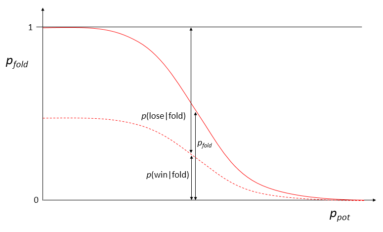

# Poker AI
*Skills: Python, Probability*

### Overview
This is a simple straight heads-up poker game. The player and computer are each dealt a 5 card hand, with no drawing. The algorithm uses card counting, combinatorics, probability, Bayes theorem, logistic regression, and heuristics.

The computer cannot 'see' the player's cards except if they are revealed at the end of a showdown. The computer card counts to determine the probability of the player having a better hand. At any stage in betting, the computer calculates the probability threshold for which the expectation value of money won is 0, then creates a default average cumulative probability curve for folding.

The player's cumulative probability of folding is generated using logistic regression on the last 100 player actions. By comparing the mean cumulative probability to the player's model, the computer determines if the player is cautious or aggressive, and estimates the probability the player is bluffing or will fold prematurely. Using Bayes theorem, the computer recalculates the probability that the player will be under the threshold probability. This is used to update the probability that the player will have a hand that beats the computer's hand. If the probability that the computer's hand is higher plus the probability that the player's hand is higher and the player folds is lower than the threshold, the computer may raise. The frequency of raising is determined by how good the computer's hand is and/or how many successful showdowns have occurred.

### Combinatorics
The Poker AI stores a copy of the deck, which is called the computer deck. By card counting, it removes the cards that it has drawn and the cards that have been revealed during showdowns. The probability of the player having a hand higher than each hand, is then recalculated with this reduced computer deck. The AI then makes betting decisions based on these probabilities.

The probability of each Poker hand is straightforward to determine analytically for a full deck, but for partial decks it becomes extremely difficult, especially when one must consider the ranking based on the high card. A consistent way of calculating the probability is by actually iterating through combinations, (combined with some theoretical simplifications). These methods are summarized below.

__Straight Flush__\
5&#9824;  6&#9824;  7&#9824;  8&#9824;  9&#9824;\
For each suit and each value (not including 2 and 3 since they cannot be the high card in a straight), if the card is in the deck, the count is 1 if the card and the 4 preceeding cards are in the deck, and zero otherwise. 

__Flush__\
2&#9825;  K&#9825;  4&#9825;  7&#9825;  9&#9825;\
For each suit and each value (excluding 2-5, since they cannot be the high card of a flush), if the card is in the deck, the number *n* of cards of the same suit below the high card value is calculated, then the combinations are C*n*4. Finally, the number of associated straight flushes (calculated above) must be subtracted.

__Straight__\
3&#9824;  4&#9825;  5&#x25CA;  6&#9825;  7&#9827;\
For each suit and each value (not including 2 and 3 since they cannot be the high card in a straight), if the card is in the deck, the count is zero if there are not at least 1 of the five values required. Otherwise, the number of cards of each required value (high card's value and the 4 preceeding numbers) are multiplied together to give the number of combinations. Then the number of associated straight flushes is subtracted once again.

__No Pair__\
2&#9824;  4&#9825;  8&#9824;  Q&#9825;  J&#9827;\
For each suit and each value (excluding 2-5 since they cannot be the high card in no pair), if the card is in the deck, the number of each value lower than the high card is counted. The total combinations is the sum of the products of these counts for every combination of 4 cards out of the available cards lower than the high card. Then the combinations of straight, flush, and straight flush are subtracted.

__Full House__\
J&#9824;  J&#9825;  J&#9827;  5&#9825;  5&#9827;\
For each suit and each value, if the card is in the deck and there are at least 2 other cards of the same value but a lower suit, then the combinations of all posible pairs (C*n*2 where *n* is the number of cards with the same value) for all other values are summed. This is multiplied by the combinations of triplets (C*n*2 where *n* is the number of cards with the same value as the high card but a lower suit).

__4 of a Kind__\
Q&#9824;  Q&#9825;  Q&#9827;  Q&#x25CA;  2&#9827;\
For spades only (since the high card in a 4 of a kind must be a spade) for each value, if all 4 suits are in the deck the count is 1, otherwise it is 0.

__3 of a Kind__\
7&#9825; 7&#9824; 7&#9827;  A&#x25CA;  2&#9827;\
For each suit and value, if the card is in the deck and there are at least 2 other cards of the same value but lower suit, the combinations are calculated as C*n*2C*m*2 where *n* is the number of cards of the high value with lower suit that the high card, and *m* is the number of cards in the deck minus 3. Then the number of combinations of 4 of a kind and full house are subtracted.

__2 Pair__\
5&#9824; 5&#9827;  A&#x25CA; A&#9825;  K&#9827;\
For each suit and value, if the card is in the deck and there is at least 1 other card of the same value but lower suit, the combinations are calculated as C*n*1 (where *n* is the number of cards of the high value with lower suit that the high card), times the sum of the product of C*m*2 (where *m* is the number of cards with the same value as the second pair) and the number of cards that have a different value than the pairs (the sum is over values lower than the high card).

__1 Pair__\
4&#9827;  4&#x25CA; 3&#9825;  Q&#9827; 5&#9824; \
For each suit and value, if the card is in the deck and there is at least 1 other card of the same value but lower suit, the combinations are C*n*1 (where *n* is the number of cards of the high value with lower suit that the high card) times the sum of the product of the number of cards of each of 3 values, for all combinations of 3 values that are not equal to the value of the pair.

### Probability of Losing Hand
Once the combinations of all hands has been determined, the probability is determined by dividing by C*n*5 where *n* is the total number of cards in the deck.

The probabilities of all the different hands are arranged in order. Then the cumulative sum is used to calculated the probability of the user having a higher or lower hand than the computer. The probability of having a losing hand will be denoted as *plose*. Note that this is calculated assuming nothing is known about the opponent's hand, in other words the probability density distribution is uniform for the opponent.

### Pot Probability
Another important probability is the pot probability (related to pot odds), *ppot*. The pot probability is defined as *gain / (gain+loss)*, which, as a conservative estimate, is calculated as *(pot - total previous bet) / (pot + current bet + current raise)*. This represents the reqired probability of having a losing hand to break even on average. The higher the pot probability, the higher probability of losing the player can tolerate. For a bet to be sensible, the probability of having a losing hand and unsuccessful bluff must be less than the pot probability.

### Probability of Folding
The following are heuristic approximation models of player behavior. They are not necessarily theoretically rigorously provable, but are useful to describe the behavior generally. Note that the models are for folding vs. not folding. Calling and raising are not distinguished because they are accounted for in the pot probability (raising will lower the pot probability compared to just calling).

The probability of folding *pfold* is modeled as a logistic function. The computer will be sensible, having an initial probabilty of folding of 1/(1+e-*w*(*plose* - *ppot*)), where *w* is a constant. 

The player, however may not be sensible. To determine how reckless or conservative the user is, logistic regression is performed on the player's most recent 100 moves (or less if the game has not progressed that far). The x values are the *ppot* and the y values are 1 (fold) or 0 (not fold). This will approximate the user's probability of folding on average, *fuser*(*ppot*). On average the probability of having a losing hand is 0.5. If the inflection of the logistic regression curve is less than 0.5, the player is agressive. If the inflection is much greater than 0.5, the player is conservative.

By comparing the logistic regression results with the sensible logistic function of *f0*(*ppot*)=1/(1+e-*w*(0.5 - *ppot*)), the probability of bluffing and over-cautious folding can be estimated.

For the aggressive player, the probability of folding when it is appropriate to fold (when the player has a bad hand) is approximately *pappropriate* = *fuser*, assuming that the aggressive player will not be overcautious and fold with a winning hand (*pcautious* = 0). The probability of the player bluffing (not folding when the player has a bad hand) is *pbluff* = *f0*-*fuser*. And the probability of not folding when the player has a hand that is likely to beat the computer is *pbeat = 1-*fuser*.

For the cautious player, the probability of folding when it is appropriate to fold is *pappropriate* = *f0*. The probability of folding when the player has a good hand is *pcautious* =*fuser*-*f0*. And the probability of not folding when the player has a good hand is *pno fold*=*pbeat* assuming the player is too cautious to ever bluff (*pbluff* = 0).

### Bayes' Theorem
The goal of calculating the probability of folding is to use the player action combined with the pot probability to update the probability that the player will have a hand that beats the computer. Bayes' Theorem can be used to achieve this.

As mentioned earlier, the sensible betting means having the pot probability be no smaller than the probability of losing (*plose*). The limit of sensible behavior would be described by *ppot* = *plose* = 1-*pwin*. The prior probability for the player winning, given the pot odds, is therefore *pwin,prior* = 1-*ppot*. (Once again, *pwin* refers to the probability of winning assuming a uniform distribution for the opponent).

For the case where the player does not fold (which is the only case where the computer would need to do any calculations) the posterior probability of the player winning *pwin,post* is calculated according to Bayes' Theorem as\
((1-*ppot*) x *pbeat*)/((1-*ppot*) x *pbeat*+*ppot* x *pbluff*)

