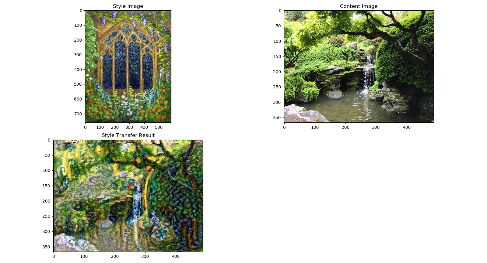
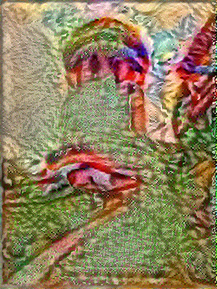

# Style Transfer Implementation
*Skills: Python, Image Processing, Convolutional Neural Networks, Gradient Descent*

### Overview
This program is an implementation of the paper L. A. Gatys, A. S. Ecker, M. Bethge. *Image Style Transfer Using Convolutional Neural Networks.* In IEEE Conference on Computer Vision and Pattern Recognition (CVPR), 2016. For technical details, refer to the paper. This implementation uses TensorFlow and VGG-19, a pre-trained convolutional neural network.

It includes features for fine tuning the loss function by choosing which layers to include in the style and content loss, and their respective weights. It also allows for adjustment of the relative weight of style and content in the final result and the number of iterations for gradient descent. 

The gradient descent is split into a slow and a fast stage. The slow stage helps mitigate noise generation by being more sensitive to small gradients at the beginning, so flatter areas will descend appropriately and consistently. This helps in areas of the picture with little content information.

### Usage
Below is a screenshot of the user interface for parameter setting.

The file paths of the painting, photo, and output must be entered. If nothing else is changed, default parameter settings will be used. Press "OK" when finished. This will cause the program to start processing the images. When it is finished, it will display the results as follows.

Once this window is closed, the output image will be saved automatically to the output file path.

### Parameter Description
All parameters will be cast as integers or floats, so do not use any inappropriate characters like letters.

The first set of parameters are the weights for the different layers that define style and content. These weights will be cast as floats. These vectors will be normalized later on so the weights can be any number. For content weights, it is recommended to use convolutional layer 2 in blocks 3, 4, or 5, or a combination thereof. The higher the block, the more loosely the content representation will adhere to the photo. For style representation, it is recommended to use layer 1 from any combination of blocks. These can be varied in order to achieve different results. Try experimenting.

The painting and photo scaling factor will scale the image. These should be numbers less than one. For very high resolution images, small scaling factors are recommended to cut down on processing time. For reasonable processing times, the scaled images should be less than 500,000 pixels. Depending on system memory, the program may not be able to handle exceedingly large images.

Content to style ratio is the ratio of weights of content loss and style loss. The higher the ratio, the more the final image will look like the photo (i.e. less stylized).

The program allows specification of the number of steps and learning rate for each gradient descent stage. A smaller learning rate is recommended for the first stage to avoid random noise generation. If the learning rate is too high the result may be grey or noisy patches.

