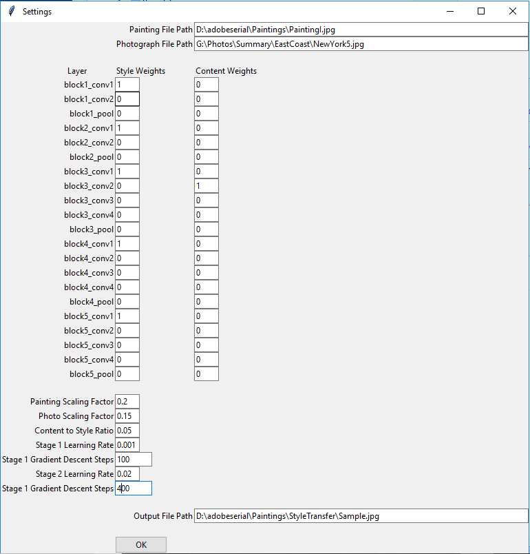

# Style Transfer Implementation
*Skills: Python, Image Processing, Convolutional Neural Networks, Gradient Descent*

### Overview
This program is an implementation of the paper L. A. Gatys, A. S. Ecker, M. Bethge. *Image Style Transfer Using Convolutional Neural Networks.* In IEEE Conference on Computer Vision and Pattern Recognition (CVPR), 2016. For technical details, refer to the paper. This implementation uses TensorFlow and VGG-19, a pre-trained convolutional neural network.

It includes features for fine tuning the loss function by choosing which layers to include in the style and content loss, and their respective weights. It also allows for adjustment of the relative weight of style and content in the final result and the number of iterations for gradient descent. 

The gradient descent is split into a slow and a fast stage. The slow stage helps mitigate noise generation by being more sensitive to small gradients at the beginning, so flatter areas will descend appropriately and consistently. This helps in areas of the picture with little content information.

### Usage
Below is a screenshot of the user interface for parameter setting.

The file paths of the painting, photo, and output must be entered. If nothing else is changed, default parameter settings will be used. Press "OK" when finished. This will cause the program to start processing the images. When it is finished, it will display the results as follows.

Once this window is closed, the output image will be saved automatically to the output file path.

