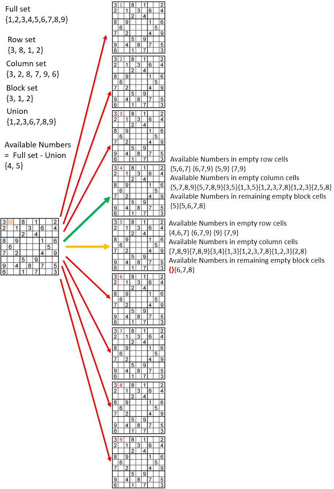

# Sudoku Solver
*Skills: Python, Algorithms*

### Overview

This program solves any solvable Sudoku puzzle and can generate random solvable puzzles. 

Set operations are used to check for validity of entries and recalculate the available numbers (valid values) for each cell. An entry is valid if it is not in the union of values in the same row, column, and block. The possible values for a cell are the set difference between the set of integers 1-9 and the union of all numbers in the same row, column, and block. 

A depth first search approach is used to solve the puzzle. Rather than just go through all values of every cell, the game tree is essentially trimmed by only evaluating valid values of the cell, as calculated using the set operations mentioned above. 

In addition, to prevent going too far down futile paths, the criterion for moving to the next cell is that the set of valid values for all remaining cells is not empty. This is verified by recalculating the sets of valid values for cells in the same row, column, and block as the cell being entered (only these cells would be effected by setting the value of the particular cell). An example is provided below.

For the target the valid values are 4 and 5. So branches for other numbers are effectively trimmed. Then for the number 5, the bottom left cell in the same block has no valid values, therefore that branch is also eliminated. The search can proceed using the remaining value of 4.

Random puzzles are generated by performing the same depth first search procedure on an empty puzzle. Randomization is achieved by shuffling the order of the numbers in the set of possible values for a cell. Then the numbers in a certain fraction of cells are randomly deleted.
