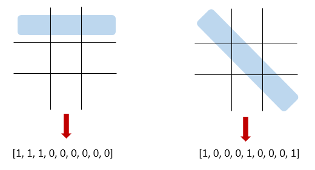
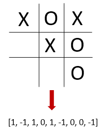
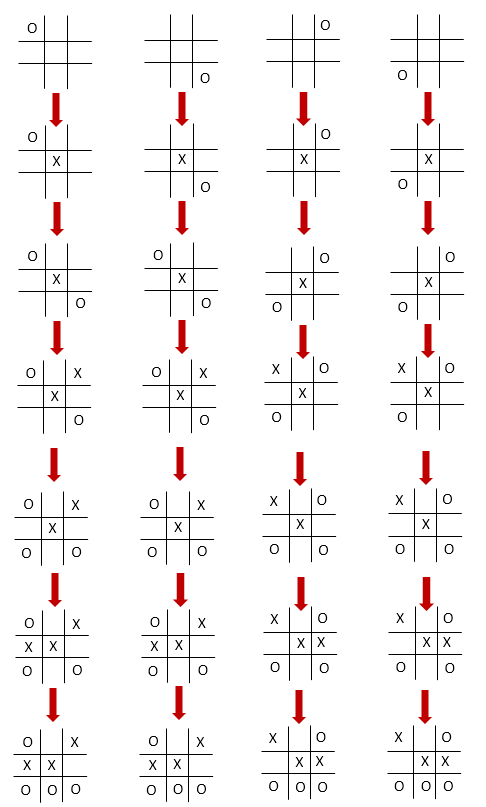

# Unbeatable Tic-Tac-Toe AI
*Skills: Python, Linear Algebra*

### Strategy Overview
This program is a Tic-Tac-Toe AI that has 3 levels of difficulty. The Hard mode is unbeatable. Rather than using the common minimax algorithm, this AI uses a custom deterministic algorithm based on linear algebra. 

First, the gameboard (a 3x3 matrix) is flattened to a row vector of length 9. For each winning path, a vector is created with 1s where the path is, and 0s elsewhere. For example

Each of the path vectors are stacked to form a path matrix __P__, whose entries are shown below.\
1  1  1  0  0  0  0  0  0\
0  0  0  1  1  1  0  0  0\
0  0  0  0  0  0  1  1  1\
1  0  0  1  0  0  1  0  0\
0  1  0  0  1  0  0  1  0\
0  0  1  0  0  1  0  0  1\
1  0  0  0  1  0  0  0  1\
0  0  1  0  1  0  1  0  0

The state of the game is represented by a similar vector, except that the user's marker (O) is represented by -1 and the computer's (X) is represented by 1. For example

The absolute value of the game state vector indicates which cells are occupied. 

The X Occupancy score is defined as the dot product of a path vector with the game state vector, which indicates the occupancy of Xs in the path minus the occupancy of Os. The Total Occupancy score is defined as the dot product of the path vector with the absolute value of the game state vector, which indicates the total occupancy of the path. A score for each path is assigned (using a dictionary with tuples as keys) based on the values of these two dot products according to the following table, which is based on heuristic reasoning.

|X Occupancy|Total Occupancy|Path Score|
|-----------|---------------|----------|
|     2     |       2       |    30    | 
|    -2     |       2       |    10    |
|     1     |       1       |     2    |
|    -1     |       1       |   1.5    |
|     0     |       0       |     1    |
|    -1     |       3       |     0    |
|     1     |       3       |     0    |
|     3     |       3       |     0    |
|    -3     |       3       |     0    |
|     0     |       2       |     0    |

The score of 30 is assigned to the tuple (2,2), which corresponds to the case where the computer has 2 Xs in a path. This is given the highest score because the computer is one move away from winning. The values (-2,2) corresponds to 2 Os in a path, which mean the computer is one move away from losing. It has the second highest score because the computer must block the user from winning. However, it is still lower than (2,2) because if the computer wins first it doesn't matter if the user is one move from winning. 

The tuple (1, 1) corresponds to one X and 2 empty cells in a path. This score is slightly higher than the next two cases because it represents a possible path for the computer to win (it is not blocked by any Os) and the computer needs 2 cells to win. The next tuple (-1, 1) corresponds to one O and 2 empty cells in a path. The score is slightly higher than the next case because the computer has 2 cells in the path that can block the user and advance towards building another path of its own. The tuple (0,0) corresponds to an empty path. This represents a potential path for the computer to win, but since it is unoccupied the computer needs all 3 cells to win, which gives more opportunity for the user to block the path. 

The tuples with Total Occupancy of 3 correspond to paths that are completely occupied, so they have a score of 0. The tuple (0, 2) corresponds to one X and one O in the path. Placing an X here does not block the user since there is already an X in the path, and there is only one possible cell to occupy for the computer. Since there is not much to gain with this path, the score is also 0.

The paths form a row vector __s__ of dimension 8. The total score fo each cell is given by the vector __c__=__P__T__s__T.

This vector __c__ is calculated before the computer makes a move. The computer then chooses the cell with the highest score based on the vector __c__. If there is a tie, the computer always picks the first of equivalent cells in the vector. This is what leads to the deterministic nature of the Hard mode AI. Because it never chooses the other equivalent cells, it trims the tree of possible games that can occur.

The resulting AI is capable of winning in all but a few scenarios, for which a separate strategy is programmed.

### Testing Unbeatability
In order to test whether or not the AI is unbeatable, all possible games are simulated. The AI still follows the above algorithm, but the simulated user will iterate through all possible moves. 

To perform the iteration, a custom iterator was created that takes in a list and returns a series of lists one at a time. The input list is the number of possible moves at each turn. The output lists are all the possible sequences of moves, where the number *i* in the list represents the *i*th possible move (*i*th available cell, in numerical order). 

The iterator basically counts in a variable base number system, where the base of the each digit is the number in the input list. For example if the list was \[10,10,10\] the cooresponding numbers would be simply counting up from 0 to 999: 000, 001, 002, 003, ... 999, and output lists would be \[0,0,0\], \[0,0,1\]...\[9,9,9\]. However, if the input list is \[4,3,2\] then the counting would look like 000, 001, 010, 011, 020, 021, 100, 101, 110, 111, 120, 121, 200 ... 321 instead. 

If the computer goes first, the available cells for the user to choose from are 8, 6, 4, 2 for the user's four turns respectively. If the user goes first, the available cells are 9, 7, 5, 3, 1 for the user's five turns respectively. These are the two possible input lists for the iterator. In each game the simulated user will move according to the output of the iterator. For example if the computer goes first and the iterator output is \[*i, j, k, l*\] then the user will take the *i*th empty cell on the first move, the *j*th on the second, the *k*th on the third, and the *l*th on the last move (according to Python indexing, meaning the first corresponds to the 0th).

### Exceptional Scenarios
The trimmed game tree (due to the deterministic nature of the Hard mode algorithm) has only 1329 possible games. Based on the scoring and testing procedures defined above, testing shows the computer can lose 4 out of 1329 games. Theses four scenarios are in fact symmetry equivalent, as shown below. In each scenario the user has 2 opposite corners and the computer has the center cell. The scoring system will make the computer take another corner, which can result in a loss for the computer if the user takes the final corner.

The score algorithm is therefore overridden in those specific scenarios to block the user from winning. Instead of the corner cell, the computer is forced to take an edge cell (the top middle cell). After this modification to the algorithm, testing showed that the user cannot win any games, meaning the AI is unbeatable. (It is not certain, however, whether the number of wins vs. ties is maximized or not).

### Easy and Medium Modes
Easy and Medium modes are achieved by introducing random error in the scoring dictionary. The average size of the random error is larger for Easy mode than Medium mode. This random error results in the computer sometimes choosing a less than optimal move.

